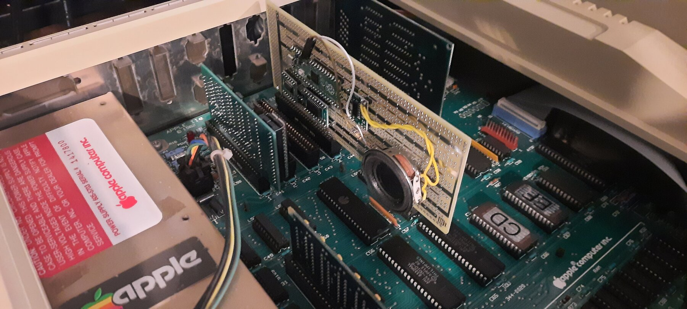
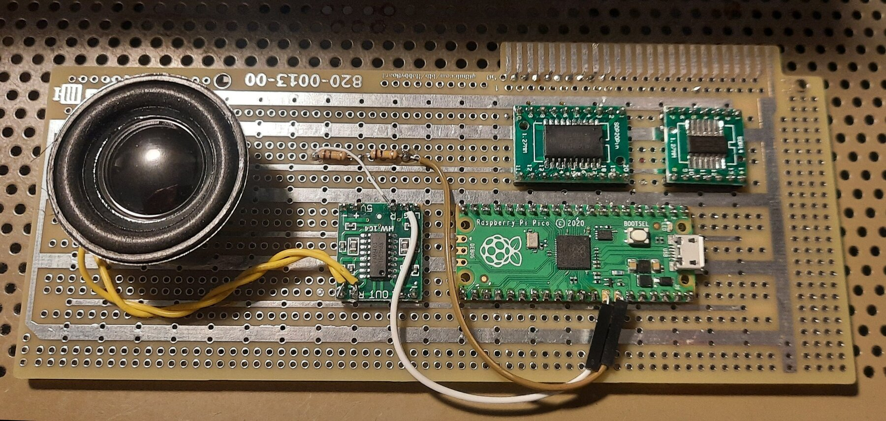
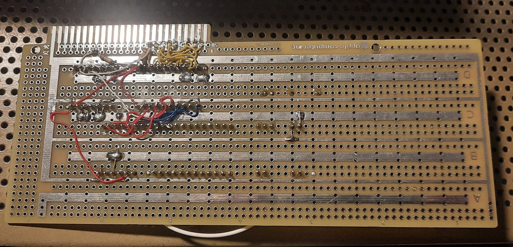
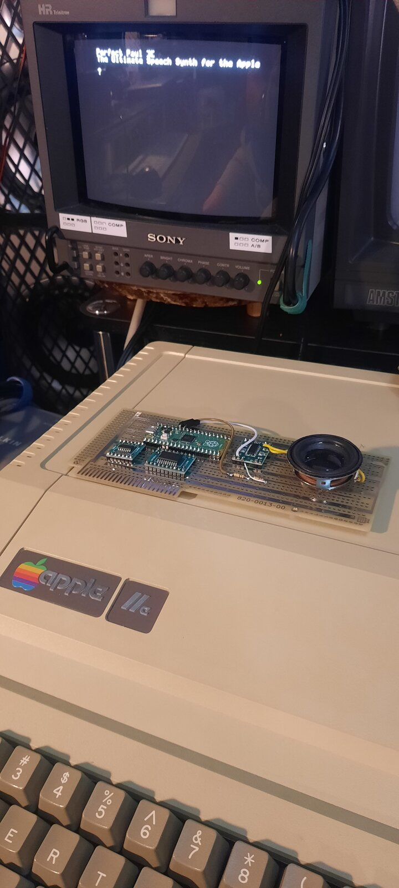

# Perfect Paul ][

A DECtalk speech synthesizer card for the Apple II, built on a Raspberry Pi
Pico. Named for DECtalk's default voice, `[:np]`.

It speaks plain text, sings in DECtalk's phoneme mode, and holds a conversation.
Drive it from BASIC with `POKE`.



**Status: working on real hardware.** The PWM build has been verified end to
end in an Apple IIe. The card pictured is a hand-wired prototyping board — the
PCB is still work in progress and will be added here once it has been
fabricated and tested. The I2S build compiles but has not yet been run.

## Watch it

[](https://youtu.be/u6aQdsFBBXw)

**[Perfect Paul II - A New Speech Synthesizer For The Apple II](https://youtu.be/u6aQdsFBBXw)**
— the card talking, singing *Daisy Bell*, and running ELIZA on real hardware.

## Talking to it

```basic
10 DR = -16192 : REM SLOT 4
20 T$ = "HELLO FROM DECTALK"
30 FOR I = 1 TO LEN(T$): POKE DR,ASC(MID$(T$,I,1)): NEXT I
40 POKE DR,13
```

That is the entire interface. Bytes written to the card's slot window are
queued as text; a carriage return speaks the line.

### Any slot works

The card decodes no address lines. It relies entirely on `/DEVSEL`, which the
motherboard asserts for whichever slot the card is in, so it works in **any slot
from 1 to 7** with no jumpers and no firmware change. Only the `DR` constant in
BASIC changes:

| Slot | Address | `DR` | | Slot | Address | `DR` |
|---:|---:|---:|---|---:|---:|---:|
| 1 | `$C090` | `-16240` | | 5 | `$C0D0` | `-16176` |
| 2 | `$C0A0` | `-16224` | | 6 | `$C0E0` | `-16160` |
| 3 | `$C0B0` | `-16208` | | 7 | `$C0F0` | `-16144` |
| 4 | `$C0C0` | `-16192` | | | | |

The window is `$C080 + 16 × slot`. A0-A3 are intentionally not decoded, so all
16 addresses in it are mirrors of the same write-only register.

On an Apple II+ note that slot 0 holds the Language Card and slot 6 is almost
certainly your Disk II, so 2, 4 or 5 are the practical choices.

## How it works

Core 0 receives bytes from an Apple II slot write cycle using RP2040 PIO. Core 1
runs DECtalk synthesis and feeds the audio path. There is no slot ROM, no status
register, and no read cycle — the card is write-only, which is what keeps the
hardware down to two logic chips.

```
Apple D0-D7      ->  74LVC245A  ->  Pico GP0-GP7
/DEVSEL OR R/W   ->  74LVC32    ->  Pico GP8   (/WRSEL)
```

Both buffers run from the **Pico's 3.3 V rail**, not the Apple's +5 V. LVC
inputs carry no clamp diode to V<sub>CC</sub> and are specified to 5.5 V
independent of V<sub>CC</sub>, so feeding them 5 V Apple TTL is the
datasheet-supported case rather than a tolerated one. That is what removes the
need for series resistors, and it means power sequencing does not matter.

The PIO program keeps the newest data sample taken wholly inside the `/WRSEL`
low pulse and pushes it when the strobe rises. This matters: a 6502 does not
drive valid data until well after `/DEVSEL` falls, so sampling at the start of
the window would latch garbage. Sampling at the end is what conventional
Apple II cards do with a '374.

See **[pico-apple2/HARDWARE-74LVC.md](pico-apple2/HARDWARE-74LVC.md)** for
pin-by-pin wiring, power, and PCB notes.

## The card

> **The PCB is still to come.** Everything shown and documented here is a
> hand-wired prototype on perfboard. Board files are work in progress and will
> be added to this repository once the first PCB has been fabricated and
> tested. Layout notes are already in
> [pico-apple2/HARDWARE-74LVC.md](pico-apple2/HARDWARE-74LVC.md).

**Component side.** Left to right: speaker, PAM8403 class-D amplifier module,
Raspberry Pi Pico, and the two SOIC-to-DIP breakouts carrying the `74LVC245AD`
(SO20, wide body) and `74LVC32AD` (SO14, narrow body) — note they are different
package widths. The two axial resistors are the audio attenuator.



**Solder side.** Slot edge-connector wiring. The data pins run backwards: D7 is
slot pin 42, D0 is slot pin 49, which is an easy and silent mistake to make.



**Running.** The screen is the banner from `PERFPAUL.bas`, and the speaker is
on the card itself.



## Build

The firmware is a target for [DECtalkMini](https://github.com/dectalk/DECtalkMini).
**This repository deliberately does not vendor that tree** — see
[Licensing](#licensing). Fetch it yourself and drop this target in:

```bash
git clone https://github.com/dectalk/DECtalkMini
cp -r pico-apple2 DECtalkMini/platforms/

export PICO_SDK_PATH=/path/to/pico-sdk
export PICO_EXTRAS_PATH=/path/to/pico-extras
cd DECtalkMini/platforms/pico-apple2
cmake --preset pico-pwm-release        # or pico-i2s-release
cmake --build --preset pico-pwm-release
```

Requires Pico SDK 2.x and pico-extras. Two executables are produced:

- `dectalk_apple2.uf2` — the card firmware
- `dectalk_selftest.uf2` — speaks a phrase loop with no Apple II and no slot
  wiring attached, for bringing up the audio path on its own

### If the build fails to link

Older DECtalkMini checkouts fail on every `NO_FILESYSTEM` target with
`region RAM overflowed` — the 390 KB dictionary lands in `.data` and overflows
the RP2040's 264 KB of SRAM. This was
[issue #40](https://github.com/dectalk/DECtalkMini/issues/40), fixed upstream in
August 2026. If you hit it, update DECtalkMini. Verify with
`arm-none-eabi-size -A`: `main_dict` belongs in `.rodata`, and `.data` should be
about 25 KB, not about 424 KB.

## Audio

**PWM** is the verified path: GP28 into an amplified input.

### What the prototype actually uses

The card in the photographs uses **2 × 100 kΩ in series and no capacitors at
all**, straight into a PAM8403 module. It sounds fine, and it is the
configuration everything in `VALIDATION.md` was verified with — so it is
documented here honestly rather than quietly replaced by the better circuit
below.

Be clear about what it is, though: 200 kΩ alone is a **voltage divider, not a
filter**. It works against the PAM8403's input impedance to bring the Pico's
3.3 V logic swing down to roughly line level, which is necessary — but it
attenuates the carrier and the speech by the same ratio, so it does not improve
the carrier-to-signal ratio at all. What actually keeps the ultrasonic content
inaudible is that the speaker cone cannot move at 353 kHz, plus the amplifier's
finite bandwidth. The energy is still there; it just never becomes sound.

### What the PCB will use

DECtalk here is an 11025 Hz stream with nothing above 5.5 kHz, while
`pico_audio_pwm` carries a ~353 kHz 1-bit carrier. That gap is enormous, so
filtering hard costs nothing. Two poles near 7 kHz:

```
GP28 --[1k]--+--[1k]--+--||--> amplifier input
             |        |   10uF
           22nF     22nF
             |        |
            GND      GND
```

That beats a single pole at 16 kHz by more than 25 dB on the carrier, and its
much lower source impedance is far less prone to picking up hum and digital
hash inside a computer than a 200 kΩ node is.

It matters most with a class-D amplifier like the PAM8403, which switches at a
few hundred kHz itself and will intermodulate with any surviving carrier, and
for EMI — unfiltered ultrasonic energy leaving on speaker leads next to
composite video is a plausible source of interference patterns on screen.

If you have already built the resistor-only version, one capacitor upgrades it
in place: 220 pF from the junction between the two 100 kΩ resistors to ground
puts a real pole at about 7 kHz without rewiring anything.

**I2S** (GP20/21/22) is the better end state and needs no code change — a
MAX98357A drives a speaker directly, a PCM5102 gives line out with negligible
slot current. Untested so far.

Note the PWM build runs the RP2040 at **96 MHz**, not the default 125 MHz.
`pico_audio_pwm`'s PIO program assumes a 48 MHz PIO clock and the library never
sets a divider, so at 125 MHz everything plays 2.6× too fast. Running at 96 MHz
with an exact ÷2 divider keeps DECtalk twice the CPU budget that the usual
`set_sys_clock_48mhz()` would leave it.

## Demo programs

In [`basic/`](basic/), all verified on hardware. Renderings of what they should
sound like are in [`audio/`](audio/), produced from the DECtalk native build so
you can listen without an Apple II.

| Program | What it does |
|---|---|
| `SPEAK.bas` / `APPLESPEECH.bas` / `PERFPAUL.bas` | Type a line, hear it spoken |
| `DAISY.bas` | Sings *Daisy Bell* in phoneme mode, ~23 s |
| `ELIZA.bas` | A talking Weizenbaum-style therapist |

`DAISY` uses `[:phone arpa speak on]` with explicit `<duration,pitch>` on each
phoneme. The arrangement comes from the author's own `sing_daisy()` in
[Talker-80](https://github.com/lambdamikel/Talker-80). DECtalk note *n* maps to
MIDI note *n*+35, so n=10 is A2 at 110 Hz if you want to transpose it.

`ELIZA` has 21 keywords with rotating responses, pronoun reflection, and generic
fallbacks, and speaks every reply. It reads input with `GET` rather than
`INPUT`, because `INPUT` splits on commas and prints `EXTRA IGNORED` the moment
anyone types one.

### Changing the slot

**Every demo program ships set to slot 4.** Each one sets `DR` on exactly one
line, so switching slots is a one-line edit — no other change is needed
anywhere:

| Program | Line to change |
|---|---|
| `DAISY.bas` | `30 DR = -16192: REM SLOT 4  ($C0C0)` |
| `ELIZA.bas` | `30 DR = -16192: REM SLOT 4  ($C0C0)` |
| `SPEAK.bas`, `APPLESPEECH.bas`, `PERFPAUL.bas` | `10 DR = -16192` |

Substitute the value for your slot from the [table above](#any-slot-works). For
a card in slot 5, for instance:

```basic
]LOAD ELIZA
]30 DR = -16176: REM SLOT 5  ($C0D0)
]SAVE ELIZA
]RUN
```

If you would rather not edit anything, compute it at run time from a slot
number — `$C080` is `-16256`, and each slot is 16 bytes further on:

```basic
10 S = 5 : DR = -16256 + 16 * S
```

That form is worth using in your own programs, since it makes the slot a single
obvious constant at the top rather than a magic negative number.

### Nothing to change in the firmware

Slot selection is *only* a BASIC concern. The card decodes no address lines, so
the same `.uf2` runs unmodified in any slot — there is no build option, jumper,
or constant to set. Moving the card between slots needs no reflash.

### Inline command gotcha

DECtalkMini lists voices **by name only** — `np`, `nb`, `nh`, `nf`, and so on.
The numeric form `[:n0]` that some other DECtalk implementations accept is
rejected, **and the rejection is spoken aloud** as a ~1.5 second error while the
rest of the utterance still works.

That failure mode generalises: an unrecognised command does not fail silently or
visibly, it just adds speech. Comparing two renders that both contain the error
will never reveal it. Render with the native `say` build and compare duration
against a known-good baseline instead.

## Licensing

**The adapter files in this repository are MIT licensed** — see
[LICENSE](LICENSE). That covers the firmware, the PIO program, the build files,
the documentation, the BASIC programs, and the photographs.

**It does not cover DECtalk.** The DECtalkMini core carries affirmative
proprietary notices from Force, Fonix Corporation, and Digital Equipment
Corporation, with no repository-wide license grant. That is why this repository
contains no DECtalk source and **no compiled `.uf2`** — any firmware binary
embeds the core and its 390 KB dictionary. Build your own from your own
DECtalkMini checkout, and read
[LICENSE-NOTE.md](LICENSE-NOTE.md) before redistributing anything you build.

For the same reason there is no bootable disk image here: one would contain
Apple's ProDOS and BASIC.SYSTEM. The `.bas` sources are provided instead — put
them on a disk of your own with
[AppleCommander](https://github.com/AppleCommander/AppleCommander):

```bash
java -jar AppleCommander-ac.jar -bas YOURDISK.dsk ELIZA < basic/ELIZA.bas
```

## Status and limitations

Verified on hardware: the 74LVC interface, the PIO capture protocol, the
core-0/core-1 split under real traffic, plain text, singing, and interactive
use.

Not yet verified: the I2S path, long-run stability, slot current under sustained
use, and any machine other than the one tested. The five slot signals used
(D0-D7, `R/W`, `/DEVSEL`, +5 V, GND) are common to the II, II+ and IIe, so the
design should be model-independent, but only one machine has run it.

**No PCB exists yet.** The design has only ever run as a hand-wired prototype,
so nothing here has been validated in copper — in particular the signal-integrity
reasoning in the hardware notes is reasoned, not measured. Board files are work
in progress.

There is no hardware flow control. PIO captures each selected write into an
eight-word FIFO, which is ample for `POKE` traffic; a tightly optimised 6502
loop writing a continuous stream can overrun it.

[pico-apple2/VALIDATION.md](pico-apple2/VALIDATION.md) records exactly what has
and has not been tested.
