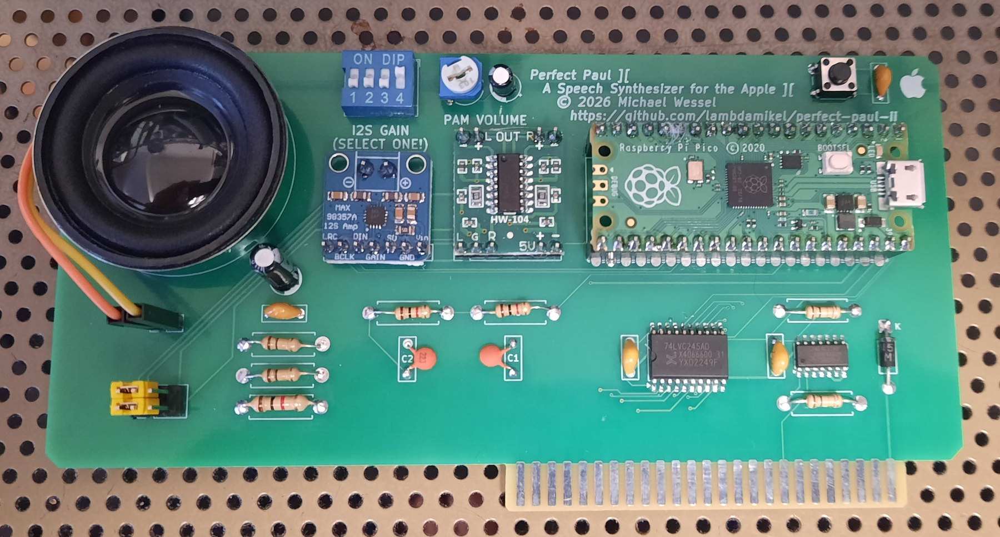

# Perfect Paul ][

A DECtalk speech synthesizer card for the Apple II, built on a Raspberry Pi
Pico. Named for DECtalk's default voice, `[:np]`.

It speaks plain text, sings in DECtalk's phoneme mode, and holds a conversation.
Drive it from BASIC with `POKE`.



**Status: finished.** The final revision 2 board has been fabricated,
assembled and tested in an Apple II, and everything works. The card announces
itself out loud at power-up, and both audio paths — I2S through a MAX98357A
and PWM through a PAM8403 — are on the board, selected with a jumper.
**The Gerbers are published:** [`pcb/gerbers-v2.zip`](pcb/gerbers-v2.zip).

## Contents

- [Watch it](#watch-it)
- [Talking to it](#talking-to-it)
  - [Any slot works](#any-slot-works)
- [How it works](#how-it-works)
- [The card](#the-card)
  - [Gerbers](#gerbers)
  - [Bill of materials](#bill-of-materials)
- [Schematic](#schematic)
  - [Electrical approach](#electrical-approach)
  - [Bus interface](#bus-interface)
  - [U2: 74LVC245 pin by pin](#u2-74lvc245-pin-by-pin)
  - [U1: 74LVC32 pin by pin](#u1-74lvc32-pin-by-pin)
  - [Pico connections](#pico-connections)
  - [Power](#power)
  - [Reset button](#reset-button)
  - [Connectors](#connectors)
- [Build](#build)
  - [Talking to it from a terminal](#talking-to-it-from-a-terminal)
  - [If the build fails to link](#if-the-build-fails-to-link)
  - [The spoken ready message](#the-spoken-ready-message)
- [Audio](#audio)
  - [PWM output filter](#pwm-output-filter)
  - [Selecting the amplifier](#selecting-the-amplifier)
  - [The gain selector](#the-gain-selector)
  - [Clock and supply notes](#clock-and-supply-notes)
- [Demo programs](#demo-programs)
  - [The VCF West 2025 demos](#the-vcf-west-2025-demos)
  - [Pacing, and why these need it](#pacing-and-why-these-need-it)
  - [Getting a demo off a TRS-80 disk](#getting-a-demo-off-a-trs-80-disk)
  - [Adding a song to the disk](#adding-a-song-to-the-disk)
  - [What the translator handles](#what-the-translator-handles)
  - [A note on what to translate](#a-note-on-what-to-translate)
  - [Rebuilding the disk image](#rebuilding-the-disk-image)
  - [Changing the slot](#changing-the-slot)
  - [Nothing to change in the firmware](#nothing-to-change-in-the-firmware)
  - [Inline command gotcha](#inline-command-gotcha)
- [Assembly and first power-up](#assembly-and-first-power-up)
- [Validation status](#validation-status)
  - [Software exercised on the card](#software-exercised-on-the-card)
  - [Not measured](#not-measured)
  - [How this was verified](#how-this-was-verified)
- [Possible future changes](#possible-future-changes)
- [Historical record](#historical-record)
- [Licensing](#licensing)

## Watch it

[](https://youtu.be/QXe7LpF3Q8w)

**[Perfect Paul II on real hardware](https://youtu.be/QXe7LpF3Q8w)** — the
latest demo.

Earlier: **[Perfect Paul II - A New Speech Synthesizer For The Apple II](https://youtu.be/u6aQdsFBBXw)**
— the card talking, singing *Daisy Bell*, and running ELIZA.

## Talking to it

```basic
10 DR = -16192 : REM SLOT 4
20 T$ = "HELLO FROM DECTALK"
30 FOR I = 1 TO LEN(T$): POKE DR,ASC(MID$(T$,I,1)): NEXT I
40 POKE DR,13
```

That is the entire interface. Bytes written to the card's slot window are
queued as text; a carriage return (`13`) speaks the line. Byte `144` (`$90`)
stops speech already in progress, as does `3` (Ctrl-C). DECtalk inline commands
are printable text, so `"[:np]HELLO"` is sent exactly the same way.

### Any slot works

The card decodes no address lines. It relies entirely on `/DEVSEL`, which the
motherboard asserts for whichever slot the card is in, so it works in **any slot
from 1 to 7** with no jumpers and no firmware change. Only the `DR` constant in
BASIC changes:

| Slot | Address | `DR` | | Slot | Address | `DR` |
|---:|---:|---:|---|---:|---:|---:|
| 1 | `$C090` | `-16240` | | 5 | `$C0D0` | `-16176` |
| 2 | `$C0A0` | `-16224` | | 6 | `$C0E0` | `-16160` |
| 3 | `$C0B0` | `-16208` | | 7 | `$C0F0` | `-16144` |
| 4 | `$C0C0` | `-16192` | | | | |

The window is `$C080 + 16 × slot`. A0-A3 are intentionally not decoded, so all
16 addresses in it are mirrors of the same write-only register.

On an Apple II+ note that slot 0 holds the Language Card and slot 6 is almost
certainly your Disk II, so 2, 4 or 5 are the practical choices.

## How it works

Core 0 receives bytes from an Apple II slot write cycle using RP2040 PIO. Core 1
runs DECtalk synthesis and feeds the audio path. There is no slot ROM, no status
register, and no read cycle — the card is write-only, which is what keeps the
hardware down to two logic chips.

```
Apple D0-D7      ->  U2 74LVC245  ->  Pico GP0-GP7
/DEVSEL OR R/W   ->  U1 74LVC32   ->  Pico GP8   (/WRSEL)
```

Both logic chips run from the **Pico's 3.3 V rail**, not the Apple's +5 V. LVC
inputs carry no clamp diode to V<sub>CC</sub> and are specified to 5.5 V
independent of V<sub>CC</sub>, so feeding them 5 V Apple TTL is the
datasheet-supported case rather than a tolerated one. That is what removes the
need for series resistors, and it means power sequencing does not matter.

The PIO program keeps the newest data sample taken wholly inside the `/WRSEL`
low pulse and pushes it when the strobe rises. This matters: a 6502 does not
drive valid data until well after `/DEVSEL` falls, so sampling at the start of
the window would latch garbage. Sampling at the end is what conventional
Apple II cards do with a '374.

The bus state machine runs on **PIO1** and the I2S implementation on **PIO0**,
so the two never contend for a state machine. The firmware disables the internal
pulls on GP0-GP7 and enables a pull-up only on GP8.

## The card

Left to right across the top: the speaker, the **I2S GAIN** DIP switch `SW2`
above the MAX98357A I2S amplifier, the **PAM VOLUME** trimmer `RV1` above the
HW-104 PAM8403 class-D module, and the Raspberry Pi Pico with the reset button
`SW1` beside it. Along the bottom: the speaker selector `J7` with its two
shunts at the far left, the PWM filter and gain resistors, `U2` (74LVC245, the
wide SOIC-20) and `U1` (74LVC32, SOIC-14), and the supply Schottky `D1` at the
right-hand end. The slot edge connector is `J1`.

The Pico and both amplifier modules plug into pin headers; everything else is
soldered to the board, the two logic chips directly as SOIC parts.

### Gerbers

[`pcb/gerbers-v2.zip`](pcb/gerbers-v2.zip) is the fabricated revision 2 board,
exported from KiCad:

| | |
|---|---|
| Size | 149.9 × 77.4 mm |
| Layers | 2, 1.6 mm |
| Minimum track and clearance | 0.2 mm |
| Smallest drill | 0.3 mm |
| Files | copper, mask, paste and silkscreen for both sides, edge cuts, PTH and NPTH drill, KiCad job file |

The job file leaves the surface finish unspecified. The card seats in an
Apple II slot, so a hard-wearing finish on the edge fingers is worth choosing
when ordering.

### Bill of materials

Designators match the board silkscreen and `perfectpaul2.net`.

| Ref | Qty | Value | Part / footprint | Function |
|---|---:|---|---|---|
| `A1` | 1 | Raspberry Pi Pico | on 2 × 20 pin headers | RP2040 module |
| `U1` | 1 | `74LVC32` | SOIC-14, 3.9 mm body | `/WRSEL` strobe gate |
| `U2` | 1 | `74LVC245` | SOIC-20, 7.5 mm wide body | data bus buffer |
| `D1` | 1 | `1N5817` | DO-41 Schottky | Apple +5 V into the card's own rail |
| `R1`, `R2` | 2 | 10 kΩ | axial | pull-ups on `R/W` and `/DEVSEL` |
| `R3`, `R4` | 2 | 1 kΩ | axial | PWM low-pass, series elements |
| `R5`, `R6` | 2 | 100 kΩ | axial | gain selector legs |
| `R7` | 1 | 1 kΩ | axial | gain selector current limit |
| `RV1` | 1 | 20 kΩ | Piher PT-6 vertical trimmer | PAM8403 volume |
| `C1`, `C2` | 2 | 22 nF | ceramic disc, 5 mm pitch | PWM low-pass, shunt legs |
| `C3` | 1 | 10 µF | radial electrolytic, 5 mm | PWM DC block, `+` toward the filter |
| `C4`, `C5` | 2 | 100 nF | ceramic disc | decoupling at `U1` and `U2` |
| `C6` | 1 | 100 nF | ceramic disc | reset debounce, across `SW1` |
| `C7` | 1 | 10 µF | radial electrolytic, 5 mm | reservoir on the 5 V card rail |
| `C8` | 1 | 100 nF | ceramic disc | decoupling on the 5 V card rail |
| `SW1` | 1 | — | 6 mm tactile push button | reset |
| `SW2` | 1 | — | 4-position DIP slide switch | MAX98357A gain |
| `J1` | 1 | — | Apple II card-edge fingers | slot connector |
| `J2`, `J3`, `J4` | 3 | — | 1 × 7 pin header, 2.54 mm | amplifier module sockets |
| `J5`, `J6` | 2 | — | 1 × 2 pin header | speaker, MAX98357A speaker output |
| `J7` | 1 | — | 2 × 3 pin header + 2 shunts | speaker source selector |

Modules and off-board parts:

| Qty | Part | Notes |
|---:|---|---|
| 1 | MAX98357A I2S amplifier breakout | Adafruit pinout; plugs into `J2` |
| 1 | PAM8403 class-D module (HW-104) | plugs into `J4` and `J3` |
| 1 | Small 4–8 Ω speaker | to `J5`; keep speaker power modest when drawn from the slot |

Both amplifiers can stay fitted; `J7` chooses which one drives the speaker. A
card built for one backend only needs just that module.

## Schematic

### Electrical approach

Everything on the card except the Apple bus itself and the amplifier supply
runs at **3.3 V**, taken from the Pico's `3V3_OUT` pin (physical pin 36): `U1`
and `U2` are both powered from it.

The LVC family is the right part for this job for one specific reason: its
inputs have **no clamp diode to V<sub>CC</sub>**. The datasheet specifies the
I/O pins to 5.5 V independent of V<sub>CC</sub>, including V<sub>CC</sub> = 0
(the `Ioff` partial-power-down specification). Feeding 5 V Apple TTL into a
3.3 V-powered LVC input is therefore the manufacturer-supported case. 74HC or
74LV parts would not do: their input clamp diodes would conduct Apple +5 V into
the 3.3 V rail.

What that buys:

- **No series resistors.** `U2`'s B outputs are push-pull CMOS on the same
  3.3 V rail as the Pico's inputs, so there is no overvoltage to limit.
- **No power-sequencing hazard.** The 5 V tolerance holds at V<sub>CC</sub> = 0,
  so it does not matter whether the Apple's +5 V or the Pico's 3.3 V comes up
  first.
- **A light load on the Apple data bus** — a few microamps per line.

Voltage thresholds line up with no translation trick. LVC at
V<sub>CC</sub> = 3.0–3.6 V specifies V<sub>IH</sub> = 2.0 V and
V<sub>IL</sub> = 0.8 V, and Apple TTL levels (≥ 2.4 V high, ≤ 0.5 V low) sit
comfortably inside them.

### Bus interface

```
Apple II slot                    3.3 V logic                         Pico

D0 (pin 49) ---------------> U2 A0     U2 B0 ------------------------> GP0
D1 (pin 48) ---------------> U2 A1     U2 B1 ------------------------> GP1
  ...                                    ...
D7 (pin 42) ---------------> U2 A7     U2 B7 ------------------------> GP7

/DEVSEL (pin 41) --+-- R2 10k --> 3V3
                    \
                     U1 gate 1, 74LVC32 OR --------------------------> GP8
                    /
R/W (pin 18) ------+-- R1 10k --> 3V3

/WRSEL = /DEVSEL OR R/W
```

`/WRSEL` is low only for a write to the selected slot's `$C0n0-$C0nF` device
window. The Pico only receives bus signals and never drives the Apple II data
bus. The data pins run backwards on the slot: D7 is pin 42 and D0 is pin 49.

**`R1` and `R2` are not optional.** `U1` runs from the Pico's 3.3 V rail, so it
is live whenever the Pico is — on the bench over USB, and with the card
installed while the Apple II is switched off. In that state `/DEVSEL` and `R/W`
float, two floating CMOS inputs can settle low, `/WRSEL` asserts on its own, and
the synthesiser speaks noise. 10 kΩ to 3V3 holds them high when the Apple is not
driving them, and is invisible when it is.

No address lines are decoded: A0–A15, `/IOSEL`, `/IOSTROBE`, `/RES` and the
interrupt and DMA daisy chains on `J1` are all unconnected.

### U2: 74LVC245 pin by pin

| Pin | Name | Connection |
|---:|---|---|
| 1 | DIR | 3.3 V — A to B, permanently Apple to Pico |
| 2–9 | A0–A7 | Apple D0–D7, slot pins 49 down to 42 |
| 10 | GND | ground |
| 11–18 | B7–B0 | Pico GP7 down to GP0 |
| 19 | /OE | ground — always enabled |
| 20 | VCC | 3.3 V, decoupled by 100 nF |

`/OE` low is intentional. Direction is fixed Apple-to-Pico, so the A side is
always an input and `U2` cannot drive the Apple bus; the PIO only captures while
`/WRSEL` is low.

### U1: 74LVC32 pin by pin

| Pin | Name | Connection |
|---:|---|---|
| 1 | 1A | Apple `/DEVSEL`, slot pin 41, and `R2` 10 kΩ to 3.3 V |
| 2 | 1B | Apple `R/W`, slot pin 18, and `R1` 10 kΩ to 3.3 V |
| 3 | 1Y | Pico GP8, directly |
| 4, 5, 9, 10, 12, 13 | unused inputs | ground |
| 6, 8, 11 | unused outputs | no connection |
| 7 | GND | ground |
| 14 | VCC | 3.3 V, decoupled by 100 nF |

The unused inputs are grounded deliberately: a floating CMOS input can sit near
mid-rail, drawing crowbar current and oscillating.

### Pico connections

These are the only Pico pins the card uses.

| Function | GPIO | Physical pin | Connection |
|---|---:|---:|---|
| D0–D7 | GP0–GP7 | 1, 2, 4, 5, 6, 7, 9, 10 | `U2` B0–B7 |
| `/WRSEL` | GP8 | 11 | `U1` pin 3 |
| I2S LRCLK / WS | GP21 | 27 | `J2` pin 1, MAX98357A LRC |
| I2S BCLK | GP20 | 26 | `J2` pin 2, MAX98357A BCLK |
| I2S data | GP22 | 29 | `J2` pin 3, MAX98357A DIN |
| PWM audio | GP28 | 34 | `R3`, into the low-pass filter |
| Reset | RUN | 30 | `SW1` and `C6` to ground |
| 3.3 V out | 3V3_OUT | 36 | `U1`, `U2`, `R1`, `R2`, `C4`, `C5` |
| Card power in | VSYS | 39 | the 5 V card rail, `D1` cathode |
| Ground | GND | 3, 8, 13, 18, 23, 28, 38 | all seven tied to ground |

Left unconnected: `VBUS` (pin 40), `3V3_EN` (37), `ADC_VREF` (35), `AGND` (33),
and GP9–GP19, GP26, GP27. GP25 is the on-board LED, which the firmware uses as a
ready indicator.

Two pins are worth never touching by hand:

- **VBUS, pin 40**, is USB +5 V. The card feeds `VSYS`, pin 39, one pin away;
  feeding `VBUS` instead would defeat `D1` and back-feed the Apple's +5 V rail
  from USB.
- **3V3_EN, pin 37.** Grounding it disables the Pico's regulator, which also
  takes `U1` and `U2` down.

Nothing else may drive GP0–GP7: `U2` drives all eight push-pull, with nothing in
series. GP0 and GP1 are UART0's default pins, so `CMakeLists.txt` disables UART
stdio and `main.c` fails the build if it is ever re-enabled. Debug output goes
over USB CDC.

### Power

```
Apple +5 V (slot pin 25) --->|--- VCC, the card's 5 V rail ---+--> Pico VSYS (pin 39)
                           D1 1N5817                          +--> J2 pin 7, MAX98357A Vin
                                                              +--> J4 pin 6, PAM8403 5 V
                                                              +--> R6, R7 (gain selector)
                                                              +--> C7 10 uF + C8 100 nF

Pico 3V3_OUT (pin 36) -------------------------------------------> U1, U2, R1, R2, C4, C5

Apple GND (slot pin 26) -----------------------------------------> common ground
```

`D1` stops USB power applied to the Pico from feeding back into the Apple II's
+5 V rail. It is a Schottky because its drop lands directly on the amplifier
supply, and 0.4 V costs less output power than a 1N400x's 0.7 V. **Everything
the card powers is on the cathode side**, so the amplifiers also work when the
card runs from USB on the bench. On the board, the band on `D1` — the cathode —
faces away from the slot connector.

`C7` and `C8` sit beside the amplifier headers, where the current is drawn. `C8`
handles the amplifiers' switching frequency; `C7` covers the audio range, so the
rail does not sag on loud passages. The logic load on `3V3_OUT` is well under a
milliamp, nowhere near the Pico regulator's budget.

**Never connect Apple +5 V to `3V3_OUT`.**

### Reset button

`SW1` grounds the Pico's `RUN` pin; release it and the card reboots and speaks
its ready message again. `C6`, 100 nF, is in parallel with the button and
debounces it against `RUN`'s internal pull-up of about 50 kΩ (a 5 ms time
constant). No external pull-up is needed.

Hold `BOOTSEL`, tap `SW1`, release `BOOTSEL`, and the Pico comes up as its USB
bootloader drive — reflashing without pulling the card or the cable. The Apple
II's own reset does **not** reach the card: slot pin 31 (`/RES`) is not wired,
so Ctrl-Reset leaves the Pico running.

### Connectors

| Ref | Pins | Connection |
|---|---|---|
| `J1` | card edge | Apple II slot |
| `J2` | 1 × 7 | MAX98357A: 1 LRC, 2 BCLK, 3 DIN, 4 GAIN, 5 SD, 6 GND, 7 Vin |
| `J6` | 1 × 2 | MAX98357A speaker output: 1 `−`, 2 `+` |
| `J4` | 1 × 7 | PAM8403 input and power: 1 L in, 2 GND, 3 R in, 6 5 V, 7 GND |
| `J3` | 1 × 7 | PAM8403 speaker output: 6 `+`, 7 `−` |
| `J7` | 2 × 3 | speaker source selector, see [Selecting the amplifier](#selecting-the-amplifier) |
| `J5` | 1 × 2 | the speaker: 1 `+`, 2 `−` |

`J2` follows the Adafruit MAX98357A breakout's own pinout, so the module drops
straight on. `J4` pins 1 and 3 carry the same mono signal, since the PAM8403 is
a stereo part fed one channel. `J3` and `J4` are seven-pin headers because that
is the module's pin spacing; the unlisted pins are unconnected. `SD` on `J2`
pin 5 is left open, so the MAX98357A is always enabled.

## Build

The firmware is a target for [DECtalkMini](https://github.com/dectalk/DECtalkMini).
**This repository deliberately does not vendor that tree** — see
[Licensing](#licensing). Fetch it yourself and drop this target in:

```bash
git clone https://github.com/dectalk/DECtalkMini
cp -r pico-apple2 DECtalkMini/platforms/

export PICO_SDK_PATH=/path/to/pico-sdk
export PICO_EXTRAS_PATH=/path/to/pico-extras
cd DECtalkMini/platforms/pico-apple2
cmake --preset pico-pwm-release        # or pico-i2s-release
cmake --build --preset pico-pwm-release
```

Requires Pico SDK 2.x and pico-extras. Two executables are produced:

- `dectalk_apple2.uf2` — the card firmware
- `dectalk_selftest.uf2` — speaks a phrase loop with no Apple II and no slot
  wiring attached, for bringing up the audio path on its own

Build the self test with the **same preset as the firmware**. It follows
`DECTALK_AUDIO_I2S`, so a self test built for the other backend is silent by
construction and tells you nothing about the one you are actually using.

### Talking to it from a terminal

The firmware keeps USB CDC as a bench input using the same line protocol as the
slot, so you can drive the card with no Apple II attached. `tools/paul-say.sh`
wraps that:

```bash
./tools/paul-say.sh "Hello from the terminal."
./tools/paul-say.sh                 # interactive, Ctrl-D to quit
./tools/paul-say.sh -l              # just listen to the card's output
```

It is the fastest way to audition DECtalk phrasing, including phoneme
spellings, without rebuilding and reflashing. If you would rather use minicom:
turn **hardware flow control off**. It defaults to on, the Pico's CDC never
asserts CTS, and the card then ignores everything you type and looks dead.
Never open the port at 1200 baud either - that is the Pico's BOOTSEL-reset
trigger.

### If the build fails to link

Older DECtalkMini checkouts fail on every `NO_FILESYSTEM` target with
`region RAM overflowed` — the 390 KB dictionary lands in `.data` and overflows
the RP2040's 264 KB of SRAM. This was
[issue #40](https://github.com/dectalk/DECtalkMini/issues/40), fixed upstream in
August 2026. If you hit it, update DECtalkMini. Verify with
`arm-none-eabi-size -A`: `main_dict` belongs in `.rodata`, and `.data` should be
about 25 KB, not about 424 KB.

### The spoken ready message

The card says **"Perfect Paul Two ready."** when the Apple II is switched on.
`DECTALK_SPEAK_STARTUP_BANNER` is `ON` by default; build with
`-DDECTALK_SPEAK_STARTUP_BANNER=OFF` for a silent boot. The wording lives in
`DECTALK_STARTUP_BANNER_TEXT` at the top of `main.c`.

That string spells "perfect" phonemically, as
`[:phone arpa speak on][prrfihkt][:phone arpa speak off]`, and **should not be
simplified back to plain text**. `perfect` has no entry in `dic/dtalk_us.dic`,
so it falls through to the letter-to-sound rules and is stressed as the verb,
per-FECT — nearly every other English `-ect` word takes final stress (affect,
collect, correct, detect). `paul`, `two` and `ready` all have dictionary
entries and stay as ordinary text. Keep the trailing `\x0b`, which is what
tells DECtalk to speak the buffer.

It is spoken after core 1 signals readiness, so the card is already accepting
slot writes while it announces itself. Note this is a **power-up** message, not
a reset message: slot pin 31 (`/RES`) is not wired to the Pico's `RUN` pin, so
Ctrl-Reset does not re-trigger it.

## Audio

**Both paths work on the card.** PWM is GP28 through a filter into the
PAM8403; I2S is GP20/21/22 into the MAX98357A. Audio quality is
indistinguishable between them. Which one the firmware drives is chosen at
build time (`pico-pwm-release` or `pico-i2s-release`); which one reaches the
speaker is chosen with `J7`.

GP28 **cannot drive a speaker directly** — the PWM path always needs an
amplifier behind its filter.

### PWM output filter

DECtalk here is an 11025 Hz stream with nothing above 5.5 kHz, while
`pico_audio_pwm` carries a ~353 kHz 1-bit carrier. That gap is enormous, so
filtering hard costs nothing. Two poles near 7 kHz, then a DC block into the
volume trimmer:

```
GP28 --[R3 1k]--+--[R4 1k]--+--|(--+
                |           |  C3  |
             C1 22nF     C2 22nF  10uF      RV1 20k ---> PAM8403 L and R in
                |           |  + on the      |
               GND         GND  filter side GND
```

| Ref | Value | Function |
|---|---|---|
| `R3`, `R4` | 1 kΩ | series elements of the two-pole low-pass |
| `C1`, `C2` | 22 nF | shunt legs, 1/(2π·1k·22n) = 7.2 kHz per section |
| `C3` | 10 µF, **`+` toward the filter** | DC block; the PWM node idles around 1.65 V |
| `RV1` | 20 kΩ | volume trimmer, wiper into the PAM8403 |

`C3`'s orientation follows from the two DC potentials: the filter side sits at
the PWM output's average, about 1.65 V at idle, while `RV1` holds the other side
at 0 V. So `+` faces the filter — the opposite of the usual rule of thumb that a
coupling capacitor's `+` faces the amplifier input.

`RV1` at 20 kΩ is high enough not to disturb the filter. The two RC sections are
unbuffered and load each other, so the real response is not a textbook
two-pole, but it still suppresses the carrier far better than a single pole. That
matters most with a class-D amplifier, which switches at a few hundred kHz itself
and would intermodulate with any surviving carrier.

### Selecting the amplifier

**Both are bridge-tied-load class-D amplifiers**: on both, the speaker `−`
terminal is not ground but a second switching output driven antiphase to `+`.
So:

- **Never ground a speaker output** on either module. It shorts a half-bridge.
- **Never tie the two modules' `−` outputs together.** That parallels two active
  drivers.

Both speaker leads are therefore switched, by `J7`, a 2 × 3 header carrying two
shunts. The middle row is the speaker and each outer row is one amplifier:

```
        left column      right column
 row 1   1  I2S-          2  I2S+       MAX98357A
 row 2   3  SPK-          4  SPK+       to the speaker
 row 3   5  PAM-          6  PAM+       PAM8403
```

| To select | Fit shunts |
|---|---|
| **I2S** (MAX98357A) | 1–3 and 2–4 |
| **PWM** (PAM8403) | 3–5 and 4–6 |

**Both shunts go vertically, one per column.** Every horizontal position is
destructive: 1–2 shorts the MAX98357A's two outputs, 5–6 the PAM8403's, and 3–4
shorts the speaker leads across whichever amplifier is selected. Never fit four
shunts. Unlike a DPDT switch, the header has no make-before-break moment that
could bridge both amplifiers on the way past. Leaving the unselected amplifier
powered into an open circuit is harmless.

### The gain selector

The MAX98357A picks one of five gains from what its `GAIN` pin is tied to. `SW2`
is a 4-position DIP; position *N* bridges pin *N* to pin *9−N*:

| Position | Connects `GAIN` to | Gain |
|---:|---|---|
| 1 | ground via `R5` 100 kΩ | 15 dB |
| 2 | ground directly | 12 dB |
| 3 | 5 V via `R7` 1 kΩ | 6 dB |
| 4 | 5 V via `R6` 100 kΩ | 3 dB |
| *none closed* | floating | 9 dB |

Close **at most one** — the silkscreen reads *SELECT ONE!*. Four positions cover
all five gains, because "floating" is simply every switch open.

`R7` makes a wrong setting harmless rather than destructive. Without it, closing
positions 2 and 3 together would short the 5 V rail straight to ground through
two switch contacts. With 1 kΩ in that leg the worst case is 5 mA, and no
combination of positions can short the rail. 1 kΩ is small enough against the
MAX98357A's internal `GAIN` bias network that position 3 still reads as "tied to
5 V".

### Clock and supply notes

The **I2S** build runs the RP2040 at the default 125 MHz, because
`pico_audio_i2s` derives its own dividers from `clk_sys`. The **PWM** build runs
at **96 MHz**: `pico_audio_pwm`'s PIO program assumes a 48 MHz PIO clock and the
library never sets a divider, so at 125 MHz everything plays 2.6× too fast. 96 MHz
with an exact ÷2 keeps DECtalk twice the CPU budget that
`set_sys_clock_48mhz()` would leave it. The bus interface works at both clocks.

Keep speaker power modest when drawing it from the slot: an amplifier at volume
can pull most of an amp from +5 V, which is acute on an Apple II+ whose supply
is already loaded by its DRAM and a Language Card.

## Demo programs

In [`basic/`](basic/), all verified on hardware. Renderings of what they should
sound like are in [`audio/`](audio/), produced from the DECtalk native build so
you can listen without an Apple II.

A ready-to-boot 140 KB image with all of them installed is in
[`disk/perfect-paul.dsk`](disk/perfect-paul.dsk) - boot it and `RUN` any of the
names below. It is a **ProDOS** disk, so it carries Apple's `PRODOS.SYS` and
`BASIC.SYSTEM` alongside the programs; those are Apple's, are not covered by
this repository's licence, and are there only to make the disk bootable. The
listings in [`basic/`](basic/) are the source of record, and
[Rebuilding the disk image](#rebuilding-the-disk-image) below shows how to
regenerate the disk from them.

| Program | What it does |
|---|---|
| `SPEAK.bas` / `APPLESPEECH.bas` / `PERFPAUL.bas` | Type a line, hear it spoken |
| `DAISY.bas` | Sings *Daisy Bell* in phoneme mode, ~23 s |
| `ELIZA.bas` | A talking Weizenbaum-style therapist |
| `SINGCOMP.bas` | Nine voices hold a singing competition, then argue about it |
| `YELSUB.bas` | Sings *Yellow Submarine*, 59 s of music in 23 phrases |
| `VOICES.bas` | A sung four-part greeting, then all nine voices introduce themselves |
| `HAL.bas` | Paul reshaped into HAL 9000 |
| `MANGER.bas` | *Away in a Manger*, 58 s |
| `ANGELS.bas` | *Angels We Have Heard on High*, 35 s |
| `BLOWMAN.bas` | *Blow the Man Down*, 14 s |

`DAISY` uses `[:phone arpa speak on]` with explicit `<duration,pitch>` on each
phoneme. The arrangement comes from the author's own `sing_daisy()` in
[Talker-80](https://github.com/lambdamikel/Talker-80). DECtalk note *n* maps to
MIDI note *n*+35, so n=10 is A2 at 110 Hz if you want to transpose it.

`ELIZA` has 21 keywords with rotating responses, pronoun reflection, and generic
fallbacks, and speaks every reply. It reads input with `GET` rather than
`INPUT`, because `INPUT` splits on commas and prints `EXTRA IGNORED` the moment
anyone types one.

### The VCF West 2025 demos

`SINGCOMP`, `YELSUB`, `VOICES` and `HAL` are translated from the **DECtalk
DTC01 demos** on the Talker/80 Model III disk shown at VCF West 2025, in
[Talker-80](https://github.com/lambdamikel/Talker-80). Those demos drive a real
DTC01 over a serial port; the TRS-80 side is a loop that pushes the bytes of a
text file out through `USR` calls. The transport has nothing in common with a
`POKE` to a slot register, but **the DECtalk payload is identical**, which is
what makes them portable at all.

The Talker/80 demos on the same disk are *not* directly portable, but not
because they use some other synthesiser family. Talker/80 drives an **Epson
S1V30120**, which carries a **DECtalk version 5** image - the same part, and the
same image, as the Emic 2. So both sides of that disk speak DECtalk. The gap is
one of *version*, not of language.

DECtalkMini is a different and older DECtalk generation; its `[:version]`
response reports `4.99`, and its command set is closer to the DTC01's than to
V5's. That is precisely why the DTC01 demos carried over with no command changes
at all, while the Talker/80 demos assume V5-era syntax and would need adapting
phrase by phrase.

(If you have met Talker/80 or LambdaSpeak's SP0256-AL2 mode, note that is an
*emulation* layered on DECtalk, not an SP0256 part. There is no SP0256 anywhere
in this story.)

Two things had to change beyond the transport:

- `VOICES` used `[:nv]`, a user-defined voice this DECtalk build does not have,
  which would have spoken an error. Dennis and Wendy replace that line - which
  makes the count genuinely nine, where the original narration promised nine and
  delivered eight.
- `YELSUB` arrives as two bracketed groups of 39 s and 20 s. Both are far past
  the 254-character limit on one utterance, so they are split at the `,<100,20>`
  phrase markers into 23 utterances.

### Pacing, and why these need it

The card is write-only. There is no status register and no flow control, and its
line queue holds **8 utterances**. When that queue fills, the firmware blocks
core 0, which stops draining the bus FIFO, and further writes are **silently
dropped** - you hear speech garble rather than an error.

`DAISY` never hits this because it sends only five utterances. `SINGCOMP` sends
23 and `YELSUB` 23, so both have to pace themselves. Each `DATA` item carries
its own length in milliseconds, exact for sung phrases because the durations are
in the notation:

```basic
2000  DATA "[IH<250,24>N DHAX<150,25> TAW<750,27>N ...]",2350
```

and the wait is

```basic
950 WT = MS * .9 * PF -  LEN (S$) * SD
```

`MS * .9` converts milliseconds to loop iterations, since about 900 empty
Applesoft `FOR`/`NEXT` iterations take a second. The second term matters more
than it looks: `POKE DR, ASC ( MID$ (S$,I,1))` over a 140-character phrase takes
roughly half a second on a 1 MHz 6502, which was **63% of the gap** before it
was accounted for.

Two knobs, both at the top of each program:

| | Default | Raise it if | Lower it if |
|---|---|---|---|
| `PF` | `.9` | speech garbles | you want it tighter still |
| `SD` | `3` | long phrases lag but short ones do not | long phrases run ahead |

`PF = .9` deliberately runs slightly *ahead* of real time, letting the 8-deep
queue absorb the lead so phrases play back to back. That turns the queue from a
hazard into the thing that makes singing gapless. `.8` still only reaches about
4 utterances deep; `.7` gets close to filling it and risks dropped characters.

`SD` is an estimate of the Applesoft send loop, not a measurement, so it is the
one to reach for if the gap scales with phrase length.

### Getting a demo off a TRS-80 disk

The DTC01 demos started life on a Model III floppy.
[`tools/trs80-extract.py`](tools/trs80-extract.py) reads a JV3 image, lists its
TRSDOS directory, and pulls files out - detokenizing Level II BASIC on the way:

```bash
tools/trs80-extract.py VOICDEMO.jv3 --list
tools/trs80-extract.py VOICDEMO.jv3 --cat 'SINGCOMP/TXT'            # a text file
tools/trs80-extract.py VOICDEMO.jv3 --cat 'SEND FILE' --detok       # a BASIC program
tools/trs80-extract.py VOICDEMO.jv3 --raw > flat.img                # ordered sectors
```

Extraction is a content scan over the ordered sector image rather than a walk of
TRSDOS granule chains, which is enough for the contiguous files these demo disks
use. One wrinkle it handles for you: a search string often appears **twice** -
once inside a tokenized BASIC program and once in the standalone data file - so
for a text extract it takes whichever occurrence yields the longest clean run,
and stops at the first non-text byte rather than running on into the rest of the
disk.

### Adding a song to the disk

End to end, a DECtalk song file becomes a program on the disk in three steps.
`ANGELS` is used throughout as the example; substitute your own name, up to 15
characters, letters and digits, starting with a letter.

```bash
# 1. translate: DECtalk song file -> paced Applesoft listing
tools/dt2applesoft.py "ANGELS WE HAVE HEARD ON HIGH.txt" \
    --title "ANGELS WE HAVE HEARD ON HIGH" \
    --credit "traditional, public domain" > basic/ANGELS.bas

# 2. import: listing -> tokenized Applesoft on the disk
java -jar AppleCommander-ac.jar -bas disk/perfect-paul.dsk ANGELS < basic/ANGELS.bas

# 3. verify: read it back and confirm nothing was mangled
java -jar AppleCommander-ac.jar -l disk/perfect-paul.dsk | grep ANGELS
java -jar AppleCommander-ac.jar -e disk/perfect-paul.dsk ANGELS | diff - basic/ANGELS.bas
```

**Do not skip step 3.** The `diff` will show cosmetic reformatting from the
detokenizer - `.9` prints as `0.9`, `-16192` as `- 16192`, spacing shifts - so
what you are looking for is a *line going missing*, which is what the bare-`REM`
bug does. See [Rebuilding the disk image](#rebuilding-the-disk-image).

Then `RUN ANGELS` from the `]` prompt. On real hardware the disk image also has
to reach the machine, which on a Floppy Emu means copying it to the SD card as
well - editing the image in place is not enough.

### What the translator handles

Together with `trs80-extract.py` above, these two cover the whole path from a
TRS-80 floppy to a program on an Apple II disk. **AppleCommander is the one
piece not vendored here** - it is a separate GPL project with its own releases,
linked below.

[`tools/dt2applesoft.py`](tools/dt2applesoft.py) exists so none of this has to
be redone by hand.

It handles the parts that are easy to get wrong:

- **Splitting.** A song often arrives as one bracketed group of several hundred
  characters; the firmware truncates an utterance at 254 and Applesoft will not
  accept a line over 239. Both ceilings are hard limits.

  **Words are never split.** In this notation a word like `IH<250,24>N` is one
  unit meaning "in" - the timing rides on the first phoneme and the rest of the
  word follows inside the same unit - so whitespace is the only word boundary.
  Breaking between `IH<250,24>` and `N` puts half a word in the next utterance,
  which is plainly audible. Some files carry no whitespace at all, the whole
  song being a single enormous word; only then does the splitter fall back to
  cutting at phoneme tokens, because there is nothing else to cut at.

  *Where* inside the budget it breaks decides how the rest sounds. Among the
  break points in the last 45% of a full chunk it breaks after the word carrying
  the **longest duration**: a long note usually ends a sung phrase, so the seam
  falls where a singer would breathe. On the carols here that lifted the mean
  note at a seam from about 300 ms to about 730 ms.
- **Timing.** Each utterance's length is summed from its `<duration>` fields and
  written into the `DATA` line, so the pacing is derived rather than guessed.
- **Voices.** Some files ask for `[:nv]`, a user-defined voice this build does
  not have and which would speak an error. The tool substitutes a real one and
  records the substitution in a `REM`.
- **Command spelling.** Files in the wild use `[:phone on]`,
  `[:phoneme arpabet on]` and other variants; all are normalised to
  `[:phone arpa speak on]`, the spelling `DAISY` proved on hardware.
- **`[:dv]` voice shaping** is dropped unless you pass `--keep-dv`, because
  support for it here is unverified and an unrecognised command is *spoken*
  rather than ignored.

It refuses to emit rather than produce a listing that would fail: over-long
lines, over-long utterances, or a bare `REM` line.

### A note on what to translate

The three carols above are traditional and long out of copyright, which is why
they are here. Much of the DECtalk song archive is not - it is largely recent
popular music, and a phoneme transcription is still the lyric. Translating
whatever you like for your own disk is one thing; publishing it is another. The
tool works on any input, and that choice is yours to make.

### Rebuilding the disk image

[AppleCommander](https://github.com/AppleCommander/AppleCommander) imports a
listing as tokenized Applesoft:

```bash
java -jar AppleCommander-ac.jar -bas disk/perfect-paul.dsk SINGCOMP < basic/SINGCOMP.bas
```

**Never leave a bare `REM` line in a listing you import.** AppleCommander's
tokenizer makes it swallow the following line, so

```
140  REM
150 DR =  - 16192
```

becomes one comment, `DR` is never assigned, and every `POKE DR,...` goes to
zero page. It looks exactly like a dead card. Verify any import by exporting it
again with `-e` and diffing the quoted literals; the detokenizer reformats
numbers (`.9` prints as `0.9`, `-16192` as `- 16192`), so compare literals
rather than whole lines.

### Changing the slot

**Every demo program ships set to slot 4.** Each one sets `DR` on exactly one
line, so switching slots is a one-line edit — no other change is needed
anywhere:

| Program | Line to change |
|---|---|
| `DAISY.bas` | `30 DR = -16192: REM SLOT 4  ($C0C0)` |
| `ELIZA.bas` | `30 DR = -16192: REM SLOT 4  ($C0C0)` |
| `SPEAK.bas`, `APPLESPEECH.bas`, `PERFPAUL.bas` | `10 DR = -16192` |

Substitute the value for your slot from the [table above](#any-slot-works). For
a card in slot 5, for instance:

```basic
]LOAD ELIZA
]30 DR = -16176: REM SLOT 5  ($C0D0)
]SAVE ELIZA
]RUN
```

If you would rather not edit anything, compute it at run time from a slot
number — `$C080` is `-16256`, and each slot is 16 bytes further on:

```basic
10 S = 5 : DR = -16256 + 16 * S
```

That form is worth using in your own programs, since it makes the slot a single
obvious constant at the top rather than a magic negative number.

### Nothing to change in the firmware

Slot selection is *only* a BASIC concern. The card decodes no address lines, so
the same `.uf2` runs unmodified in any slot — there is no build option, jumper,
or constant to set. Moving the card between slots needs no reflash.

### Inline command gotcha

DECtalkMini lists voices **by name only** — `np`, `nb`, `nh`, `nf`, and so on.
The numeric form `[:n0]` that some other DECtalk implementations accept is
rejected, **and the rejection is spoken aloud** as a ~1.5 second error while the
rest of the utterance still works.

That failure mode generalises: an unrecognised command does not fail silently or
visibly, it just adds speech. Comparing two renders that both contain the error
will never reveal it. Render with the native `say` build and compare duration
against a known-good baseline instead.

## Assembly and first power-up

The final board passed all of these. Run them on any new build.

**Before power:**

1. Check `U1` and `U2` orientation. SOIC parts often have no notch: with the
   marking reading normally, pin 1 is lower left.
2. Check `D1`: the band faces away from the slot connector.
3. Check `C3`'s and `C7`'s polarity against the silkscreen.
4. Fit exactly one `J7` shunt pair, vertically, and at most one `SW2` position.

**A genuine LVC part matters.** With a multimeter on diode test, black probe on
`VCC` and red on any input, a real 74LVC part reads **open** — LVC omits the
upper clamp diode, which is exactly the 5 V tolerance this design relies on. A
reading near 0.6 V means an HC, HCT or LV part, which would inject Apple +5 V
into the 3.3 V rail.

**With power:**

1. With the Apple II on and the card installed, `U1` and `U2` VCC sit at about
   3.3 V, not 5 V.
2. The 5 V card rail reaches Pico **VSYS, not VBUS**, about one Schottky drop
   below the Apple +5 V.
3. `U2`'s A-side pins swing to about 5 V and its B-side pins to about 3.3 V.
   Equal swings mean the buffer is not translating.
4. GP8 is normally high and pulses low only during a write to the card's
   `$C0nX` window.
5. With the Apple II off and the Pico on USB, GP8 still reads high. If it sits
   low, `R1` or `R2` is missing.
6. GP0–GP7 match the written byte while GP8 is low.

## Validation status

**The final revision 2 card works in a real Apple II**, assembled from the
published Gerbers and the bill of materials above. A `POKE` to the card's
device window produces intelligible speech, the card announces itself at
power-up, and the demo programs run.

What bring-up established about the design, and what the final board confirms:

- **The 74LVC interface.** 5 V Apple TTL into `74LVC245` and `74LVC32` powered
  from the Pico's `3V3_OUT`, with no series resistors anywhere, translating
  correctly in a live machine.
- **The PIO capture protocol** in `apple2_slot_rx.pio`. This was the one thing
  that could not be settled analytically: at the end of a write cycle the 6502's
  data-hold time (spec minimum 10 ns) races the decoder's `/DEVSEL` de-assert
  delay, so the last sample inside the low pulse could in principle catch a
  released bus. It does not. Slot bus capacitance holds the byte well past the
  datasheet minimum — the same reason a conventional '374-latched card works.
- **Slot wiring**, including the data pins running backwards.
- **The core-0 receive / core-1 synthesis split** under real bus traffic, and
  the `\r` to `\x0b` line protocol. PWM and I2S each run their DMA IRQ on core 1
  beside the synthesis callback, leaving core 0's slot poll uninterrupted.
- **`/WRSEL = /DEVSEL OR R/W`** correctly ignoring read cycles to the same
  window.
- **The bus at both system clocks**, 96 MHz and 125 MHz. `apple2_slot_rx.pio` is
  fully asynchronous — no delay cycles and no clock divider — so a faster clock
  only samples more often inside the `/WRSEL` window.
- **Both speech self tests** (`dectalk_selftest.uf2` from each preset) speak
  their phrase loop at the correct pitch with no Apple II attached, covering
  DECtalk synthesis, the embedded dictionary and each audio path on its own.

### Software exercised on the card

Two Applesoft programs run correctly from ProDOS on the real machine, and
between them they cover the three ways the card gets used:

- **`DAISY`** sings Daisy Bell. This exercises DECtalk's phoneme/singing mode:
  `[:phone arpa speak on]` plus explicit `<duration,pitch>` on every phoneme,
  in five utterances totalling about 23 seconds. It confirms that inline
  bracketed commands survive the slot transport intact, which plain text does
  not prove — a single corrupted byte inside `[...]` would derail the parser.
- **`ELIZA`** is interactive. This is the stronger test: sustained back-and-forth
  across a whole session rather than one scripted burst, with variable-length
  replies, and an Applesoft `GET`-based input loop running alongside the `POKE`
  stream. It exercises the firmware's line queue and the core-0/core-1 handoff
  under realistic traffic.

Together with the earlier self test, the card is now exercised on plain text,
phoneme/singing mode, and interactive use.

### Not measured

The card works; these have not been instrumented:

- Logic-analyzer timing of `/DEVSEL`, `R/W`, `/WRSEL` and D0–D7. The margin at
  the end of the write window is inferred, not measured.
- Signal integrity on the board, long-run stability, thermal behaviour, and slot
  current with a particular amplifier and speaker.
- Audio quality, beyond listening.
- Other machines. The five signals used are common to the II, II+ and IIe, so
  the design should be model-independent, but it has been tested in one
  machine.

There is no hardware flow control. PIO captures each selected write into an
eight-word FIFO, which is ample for `POKE` traffic; a tightly optimised 6502
loop writing a continuous stream can overrun it.

### How this was verified

The development record behind the claims above:

- Audited the GPIO and PIO setup against the 74LVC interface: pins are inputs,
  pulls disabled on GP0-GP7, pull-up retained on GP8, `wait 0 pin 8` resolves
  to GP8 via the IN base and `jmp pin` to absolute GP8. No functional change
  was required.
- Confirmed `LIB_PICO_STDIO_UART` is absent from the compiled definitions, so
  the GP0/GP1 contention guard reflects the build as configured, and verified
  the guard fires when UART stdio is forced on.
- Cross-built both CMake presets for RP2040 with the Arm GNU toolchain.
- Compared the adapter target with the supplied DECtalkMini Pico SDK target and
  retained its core-1 synthesis/audio arrangement.
- Reviewed the PIO program instruction by instruction. It uses one state
  machine and a joined eight-word RX FIFO.
- Confirmed against the native build that DECtalk's dictionary lookup, its
  inline `[:xx]` commands, and arpabet phoneme symbols are all case-insensitive,
  so Applesoft's uppercase-only text needs no special handling.
- Measured the singing pitch scale against the native build: DECtalk note *n*
  maps to MIDI note *n*+35, so n=10 is A2 at 110 Hz.
- Established that DECtalkMini **rejects the numeric voice form `[:n0]`** and
  speaks a ~1.5 second error while otherwise working normally. The command
  table in `include/c_us_cde.h` lists voices by name only (`np`, `nb`, `nh`,
  ...). Use `[:np]` for Perfect Paul. Abbreviated forms such as
  `[:phone arpa speak on]` and `[:rate 200]` are accepted.
- Verified every `DATA` string in both BASIC programs by reading it back out of
  the ProDOS image and rendering from the read-back copy, not from the local
  source.
- Validated the Eliza engine as a Python transliteration — keyword priority,
  pronoun reflection, response rotation — before emitting the Applesoft.

## Possible future changes

None of these is needed; the board works as published.

- **A true gain selector** — a six-pin header with one shunt, or a rotary
  switch — would make an invalid setting unreachable rather than harmless.
- **A non-polarised `C3`** would remove its orientation constraint. Anything
  from 1 µF upward keeps the high-pass corner into `RV1` below DECtalk's
  roughly 80 Hz floor.
- **Slot `/RES` to `RUN`** through one of `U1`'s spare gates, if the ready
  message should repeat on Ctrl-Reset. Keep any reset button on the gate's
  input side, or it shorts the gate output.

## Historical record

The card went through two builds before the final board. Every photograph of
them is kept here; none of these is a supported design.

### Hand-wired prototype

The first working card, on an Apple II prototyping board. The first PWM speech
came from this board.


How it differs from revision 2:

- **Point-to-point wiring** on perfboard, with the slot fingers wired by hand,
  and the two SOIC logic chips on SOIC-to-DIP breakout adapters.
- **PWM only**, through a PAM8403 module. No I2S amplifier.
- **No output filter**: two 100 kΩ resistors in series as a divider, no
  capacitors.
- **No supply diode, no reset button and no reservoir capacitor.**
- Speaker on flying leads, with no selector.

### Revision 1 PCB

The first fabricated board, and the one both audio paths were brought up on.


How it differs from revision 2:

- **No `D1`.** Apple +5 V reached the Pico's `VSYS` undiode, so USB power could
  back-feed the Apple's rail.
- **No speaker selector.** Both amplifiers were fitted with the speaker on
  flying leads, moved by hand between them.
- **A 5-position gain DIP with two directly tied legs**, one pair of which
  shorted 5 V to ground. The silkscreen said *SET ONLY ONE*; revision 2's
  4-position `SW2` with `R7` makes any combination safe.
- **No reset button**; reflashing meant unplugging USB.
- **No capacitor on the 5 V rail** at the amplifier headers.
- **`C3` reverse biased** by about 1.65 V.
- Schematic values that did not match the fitted parts: `RV1` said 50 kΩ, the
  logic was valued as 74LS parts, and several passives had no value at all.

## Licensing

**The files in this repository are MIT licensed** — see [LICENSE](LICENSE).
That covers the firmware adapter, the PIO program, the build files, the PCB
Gerbers, the documentation, the BASIC programs, and the photographs.

**It does not cover DECtalk.** The DECtalkMini core carries affirmative
proprietary notices from Force, Fonix Corporation, and Digital Equipment
Corporation, with no repository-wide license grant. That is why this repository
contains no DECtalk source and **no compiled `.uf2`** — any firmware binary
embeds the core and its 390 KB dictionary. Build your own from your own
DECtalkMini checkout, and read [LICENSE-NOTE.md](LICENSE-NOTE.md) before
redistributing anything you build.

**Nor does it cover Apple's system files.** The demo disk
[`disk/perfect-paul.dsk`](disk/perfect-paul.dsk) is a ProDOS disk, so it carries
Apple's `PRODOS.SYS` and `BASIC.SYSTEM`, which are there only to make it
bootable. The listings in [`basic/`](basic/) are the source of record.
