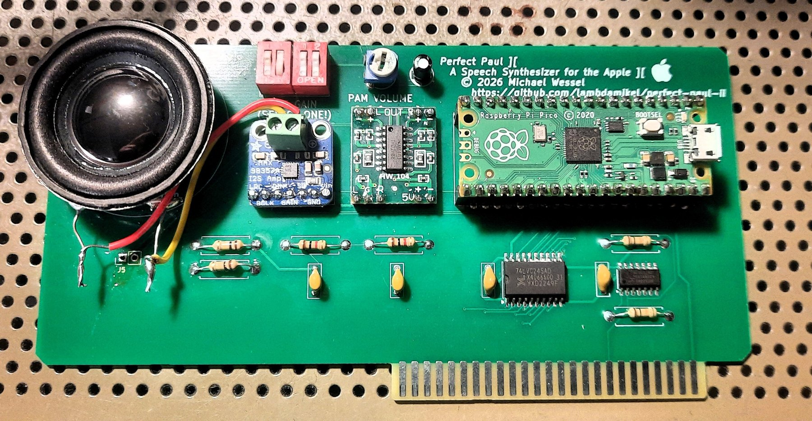

# Perfect Paul ][

A DECtalk speech synthesizer card for the Apple II, built on a Raspberry Pi
Pico. Named for DECtalk's default voice, `[:np]`.

It speaks plain text, sings in DECtalk's phoneme mode, and holds a conversation.
Drive it from BASIC with `POKE`.


**Status: working on real hardware.** Both the PWM and the I2S builds have been
verified end to end in an Apple IIe, on a fabricated prototype PCB. The card
announces itself out loud at power-up. A second board revision is designed and
awaiting fabrication.

## Contents

- [Watch it](#watch-it)
- [Talking to it](#talking-to-it)
  - [Any slot works](#any-slot-works)
- [How it works](#how-it-works)
- [The card](#the-card)
  - [The hand-wired prototype](#the-hand-wired-prototype)
- [Hardware reference](#hardware-reference)
  - [Electrical approach](#electrical-approach)
  - [Signal flow](#signal-flow)
  - [The two pull-ups are not optional](#the-two-pull-ups-are-not-optional)
  - [U2: 74LVC245A pin-by-pin wiring](#u2-74lvc245a-pin-by-pin-wiring)
  - [U3: 74LVC32 pin-by-pin wiring](#u3-74lvc32-pin-by-pin-wiring)
  - [Packages, and finding pin 1](#packages-and-finding-pin-1)
  - [Pico connections](#pico-connections)
  - [Power wiring](#power-wiring)
  - [Bill of materials for the bus interface](#bill-of-materials-for-the-bus-interface)
  - [Revision 2 designators](#revision-2-designators)
  - [Connectors](#connectors)
- [Build](#build)
  - [Talking to it from a terminal](#talking-to-it-from-a-terminal)
  - [If the build fails to link](#if-the-build-fails-to-link)
  - [The spoken ready message](#the-spoken-ready-message)
- [Audio](#audio)
  - [What the hand-wired prototype used](#what-the-hand-wired-prototype-used)
  - [What the PCB uses](#what-the-pcb-uses)
  - [Selecting between the PAM and the MAX98357A outputs](#selecting-between-the-pam-and-the-max98357a-outputs)
  - [The gain selector](#the-gain-selector)
- [Demo programs](#demo-programs)
  - [Changing the slot](#changing-the-slot)
  - [Nothing to change in the firmware](#nothing-to-change-in-the-firmware)
  - [Inline command gotcha](#inline-command-gotcha)
- [First power-up checks](#first-power-up-checks)
- [Board revisions](#board-revisions)
  - [Fixed in revision 2](#fixed-in-revision-2)
  - [Before fabricating revision 2](#before-fabricating-revision-2)
  - [Still open for a third revision](#still-open-for-a-third-revision)
  - [Layout notes, unchanged](#layout-notes-unchanged)
- [Licensing](#licensing)
- [Validation status](#validation-status)
  - [Software exercised on the card](#software-exercised-on-the-card)
  - [Not yet verified on hardware](#not-yet-verified-on-hardware)
  - [How this was verified](#how-this-was-verified)

## Watch it

[](https://youtu.be/u6aQdsFBBXw)

**[Perfect Paul II - A New Speech Synthesizer For The Apple II](https://youtu.be/u6aQdsFBBXw)**
— the card talking, singing *Daisy Bell*, and running ELIZA on real hardware.

## Talking to it

```basic
10 DR = -16192 : REM SLOT 4
20 T$ = "HELLO FROM DECTALK"
30 FOR I = 1 TO LEN(T$): POKE DR,ASC(MID$(T$,I,1)): NEXT I
40 POKE DR,13
```

That is the entire interface. Bytes written to the card's slot window are
queued as text; a carriage return (`13`) speaks the line. Byte `144` (`$90`)
stops speech already in progress, as does `3` (Ctrl-C). DECtalk inline commands
are printable text, so `"[:np]HELLO"` is sent exactly the same way.

### Any slot works

The card decodes no address lines. It relies entirely on `/DEVSEL`, which the
motherboard asserts for whichever slot the card is in, so it works in **any slot
from 1 to 7** with no jumpers and no firmware change. Only the `DR` constant in
BASIC changes:

| Slot | Address | `DR` | | Slot | Address | `DR` |
|---:|---:|---:|---|---:|---:|---:|
| 1 | `$C090` | `-16240` | | 5 | `$C0D0` | `-16176` |
| 2 | `$C0A0` | `-16224` | | 6 | `$C0E0` | `-16160` |
| 3 | `$C0B0` | `-16208` | | 7 | `$C0F0` | `-16144` |
| 4 | `$C0C0` | `-16192` | | | | |

The window is `$C080 + 16 × slot`. A0-A3 are intentionally not decoded, so all
16 addresses in it are mirrors of the same write-only register.

On an Apple II+ note that slot 0 holds the Language Card and slot 6 is almost
certainly your Disk II, so 2, 4 or 5 are the practical choices.

## How it works

Core 0 receives bytes from an Apple II slot write cycle using RP2040 PIO. Core 1
runs DECtalk synthesis and feeds the audio path. There is no slot ROM, no status
register, and no read cycle — the card is write-only, which is what keeps the
hardware down to two logic chips.

```
Apple D0-D7      ->  74LVC245A  ->  Pico GP0-GP7
/DEVSEL OR R/W   ->  74LVC32    ->  Pico GP8   (/WRSEL)
```

Both buffers run from the **Pico's 3.3 V rail**, not the Apple's +5 V. LVC
inputs carry no clamp diode to V<sub>CC</sub> and are specified to 5.5 V
independent of V<sub>CC</sub>, so feeding them 5 V Apple TTL is the
datasheet-supported case rather than a tolerated one. That is what removes the
need for series resistors, and it means power sequencing does not matter.

The PIO program keeps the newest data sample taken wholly inside the `/WRSEL`
low pulse and pushes it when the strobe rises. This matters: a 6502 does not
drive valid data until well after `/DEVSEL` falls, so sampling at the start of
the window would latch garbage. Sampling at the end is what conventional
Apple II cards do with a '374.

The bus state machine runs on **PIO1** and the I2S implementation on **PIO0**,
so the two never contend for a state machine. The firmware disables the internal
pulls on GP0-GP7 and enables a pull-up only on GP8.

## The card

**Prototype PCB.** Left to right: speaker, the MAX98357A I2S amplifier, the
PAM8403 class-D module for the PWM path, and the Pico. Both audio backends are
populated at once with the speaker on flying leads, so either can be compared
against the other — which is exactly how the I2S path was brought up. The red
DIP switches set the MAX98357A's gain, and the silkscreen reads **SET ONLY ONE**
because two of the positions would otherwise short 5 V to ground.

**This is the first prototype board only.** A second revision is in progress,
and **the Gerbers will be published here** once that version has been built and
tested. Nothing about this first board is a released design - it exists to prove
the circuit, which it now has. Layout notes and the known gaps to fix are in
[Board revisions](#board-revisions) below.



### The hand-wired prototype

The photographs below are the original perfboard card, which the first PWM
results came from. Kept for reference.

**Component side.** Left to right: speaker, PAM8403 class-D amplifier module,
Raspberry Pi Pico, and the two SOIC-to-DIP breakouts carrying the `74LVC245AD`
(SO20, wide body) and `74LVC32AD` (SO14, narrow body) — note they are different
package widths. The two axial resistors are the audio attenuator.


**Solder side.** Slot edge-connector wiring. The data pins run backwards: D7 is
slot pin 42, D0 is slot pin 49, which is an easy and silent mistake to make.


**Running.** The screen is the banner from `PERFPAUL.bas`, and the speaker is
on the card itself.


## Hardware reference

The 3.3 V level-translating interface, and the only interface this project
supports. An earlier revision-2 design used 5 V 74LS parts with series
current-limiting resistors; it is retired. Comparisons to it below are kept
because they explain why this design has no series resistors, not because it
remains an option — the old reference is in git history if you need it.

### Electrical approach

Everything on the card except the Apple bus itself runs at **3.3 V**, taken from
the Pico's `3V3_OUT` pin (physical pin 36):

- U2: `74LVC245A`, V_CC = Pico 3V3
- U3: `74LVC32`, V_CC = Pico 3V3

The LVC family is the right part for this job for one specific reason: its
inputs have **no clamp diode to V_CC**. The datasheet specifies the I/O pins to
5.5 V independent of V_CC, including V_CC = 0 (the `Ioff` / partial-power-down
specification). Feeding 5 V Apple TTL into a 3.3 V-powered LVC input is
therefore the manufacturer-supported case, not a tolerated abuse — unlike 74HC
or 74LV, whose input clamp diodes would conduct into the 3.3 V rail.

Consequences worth stating explicitly, because they are what changed from the
74LS revision:

- **No series resistors anywhere.** The '245's B outputs are push-pull CMOS on
  the same 3.3 V rail as the Pico's inputs. There is no overvoltage to limit and
  nothing to protect against.
- **No power-sequencing hazard.** The 5 V tolerance holds at V_CC = 0, so it
  does not matter whether the Apple's +5 V or the Pico's 3.3 V comes up first.
  The 74LS design needed the resistors largely to survive exactly that case.
- **Lighter load on the Apple data bus.** LVC input current is a few
  microamps per line against the 74LS245's 0.2 mA I_IL — a real improvement on a
  machine with several cards sharing the bus.
- **Faster and cleaner edges.** 4.7 kOhm into ~15 pF of pad and trace
  capacitance cost roughly 70 ns of rise time inside a `/DEVSEL` window only
  about 500 ns wide. Direct LVC drive replaces that with ~5 ns of propagation
  delay.

Voltage thresholds line up without any translation trick. LVC at V_CC = 3.0-3.6 V
specifies V_IH = 2.0 V and V_IL = 0.8 V, so Apple TTL levels (>=2.4 V high,
<=0.5 V low) sit comfortably inside them.

### Signal flow

```
Apple II data bus              3.3 V translating buffer            Pico

D0 --------------------------> U2 A1   U2 B1 --------------------> GP0
D1 --------------------------> U2 A2   U2 B2 --------------------> GP1
D2 --------------------------> U2 A3   U2 B3 --------------------> GP2
D3 --------------------------> U2 A4   U2 B4 --------------------> GP3
D4 --------------------------> U2 A5   U2 B5 --------------------> GP4
D5 --------------------------> U2 A6   U2 B6 --------------------> GP5
D6 --------------------------> U2 A7   U2 B7 --------------------> GP6
D7 --------------------------> U2 A8   U2 B8 --------------------> GP7

Apple /DEVSEL --+-- R10 10k --> 3V3
                 \
                  gate 1 of U3 74LVC32 OR -------------------------> GP8
                 /
Apple R/W ------+-- R11 10k --> 3V3

/WRSEL = /DEVSEL OR R/W
```

`/WRSEL` is low only for a write to the selected slot's `$C0n0-$C0nF` device
window. The Pico only receives bus signals and never drives the Apple II data
bus.

### The two pull-ups are not optional

R10 and R11 are the one genuinely new part of this revision, and skipping them
produces a confusing failure.

In the 74LS design U3 was powered from the Apple's +5 V, so with the Apple off
the gate was dead, its output was floating, and the Pico's internal pull-up on
GP8 held the strobe inactive. That is no longer how it works. **U3 now runs from
the Pico's 3.3 V rail, so it is live whenever the Pico is** — including on the
bench over USB, and including with the card installed while the Apple II is
switched off. In that state `/DEVSEL` and `R/W` float, two floating LVC inputs
can easily settle low, and `/WRSEL` asserts on its own. The PIO then captures
garbage continuously and the synthesiser speaks noise.

10 kOhm to 3V3 on each gate input fixes it. When the Apple is on it drives those
lines hard and 10 kOhm is invisible; when it is off they float high, so
`/WRSEL` reads idle.

The residual concern is that with the card installed and the Apple II off, these
pull-ups put 3.3 V onto two dead bus lines through 10 kOhm — bounded at roughly
0.66 mA total. That only arises if the Pico is separately USB-powered in an
otherwise dead machine, which is the configuration the deployment instructions
already tell you to avoid.

### U2: 74LVC245A pin-by-pin wiring

Standard 20-pin pinout, identical to the 74LS245 it replaces. Verify against the
exact part datasheet before layout.

| U2 pin | Name | Connect to |
|---:|---|---|
| 1 | DIR | **Pico 3V3**, not Apple +5 V; selects A-to-B direction |
| 2 | A1 | Apple D0 |
| 3 | A2 | Apple D1 |
| 4 | A3 | Apple D2 |
| 5 | A4 | Apple D3 |
| 6 | A5 | Apple D4 |
| 7 | A6 | Apple D5 |
| 8 | A7 | Apple D6 |
| 9 | A8 | Apple D7 |
| 10 | GND | Common ground |
| 11 | B8 | Pico GP7 |
| 12 | B7 | Pico GP6 |
| 13 | B6 | Pico GP5 |
| 14 | B5 | Pico GP4 |
| 15 | B4 | Pico GP3 |
| 16 | B3 | Pico GP2 |
| 17 | B2 | Pico GP1 |
| 18 | B1 | Pico GP0 |
| 19 | /OE | Ground; U2 is permanently enabled |
| 20 | VCC | **Pico 3V3** (pin 36) |

Place C1, 100 nF ceramic, directly between U2 pins 20 and 10.

DIR must go to the 3.3 V rail. LVC would tolerate 5 V on it, but tying a control
input to a rail the part is not powered from is pointless and confuses anyone
reading the board later.

Keeping `/OE` low is intentional. U2 always observes the Apple data bus, but its
direction is permanently Apple-to-Pico, so its A side is always an input and it
cannot drive the Apple bus. The PIO captures data only while `/WRSEL` is low.

### U3: 74LVC32 pin-by-pin wiring

The `74LVC32` uses the standard 14-pin `'32` pinout, identical to the `74LS32N`
it replaces, so gate 1 is wired exactly as before. Only two things change: V_CC
moves from Apple +5 V to the Pico's 3V3, and R9 (the 4.7 kOhm series resistor
between the gate output and GP8) is deleted.

| U3 pin | Name | Connect to |
|---:|---|---|
| 1 | 1A | Apple `/DEVSEL`, and R10 10 kOhm to 3V3 |
| 2 | 1B | Apple `R/W`, and R11 10 kOhm to 3V3 |
| 3 | 1Y | Pico GP8, **directly — no series resistor** |
| 4, 5 | 2A, 2B | Ground |
| 6 | 2Y | No connection |
| 7 | GND | Common ground |
| 8 | 3Y | No connection |
| 9, 10 | 3A, 3B | Ground |
| 11 | 4Y | No connection |
| 12, 13 | 4A, 4B | Ground |
| 14 | VCC | **Pico 3V3** (pin 36), not Apple +5 V |

Place C2, 100 nF ceramic, directly between U3 pins 14 and 7.

Tying the unused inputs matters more here than it did with the 74LS32. A
floating LS input pulls itself high and merely wastes power; a floating CMOS
input can sit near mid-rail, drawing crowbar current through both output
transistors and oscillating. Ground all six unused inputs as tabulated. Ground
rather than 3V3 is an arbitrary but consistent choice — it leaves the three
unused outputs low, and they go nowhere.

#### The one thing that would damage the Pico

Do not swap the '245 for LVC, delete the resistors, and leave U3 as a
**5 V-powered 74LS32 wired straight to GP8**. That was the one connection in the
74LS design where the series resistor was doing real work, and GP8 is not 5 V
tolerant. Either move U3 to 3.3 V as above, or — if you ever revert to a 5 V
gate — put R9 back.

### Packages, and finding pin 1

The reference card was built with `74LVC245AD` and `74LVC32AD`. The `D` suffix
is SOIC, at 1.27 mm pitch, so on a 0.1 inch prototyping board both need
SOIC-to-DIP breakout adapters. **The two are different widths** — the SO14 '32
is narrow body at about 3.9 mm, while the SO20 '245 is wide body at about
7.5 mm. Measure the plastic body excluding the leads before ordering adapters.
Pin numbering is identical to DIP in every standard package, so nothing in the
wiring tables changes.

SOIC parts usually have no notch. Three ways to orient them, in increasing
order of certainty:

1. **Text orientation.** Hold the part so the marking reads normally. Pin 1 is
   then at the lower left, and numbering runs counterclockwise.
2. **A molded dimple** at the pin 1 corner, often invisible head-on. Tilt it
   under a light at a shallow angle.
3. **Diode test.** Every pin has an ESD clamp diode to GND with its anode on
   the GND rail, so the red probe on GND reads about 0.65 V forward against
   every other pin. No other pin behaves that way. That is pin 7 on the '32 and
   pin 10 on the '245, both corner pins, which fixes the whole numbering.

Method 3 doubles as a counterfeit check. Reverse the probes — red on an input,
black on VCC — and a genuine LVC part reads **open**, because LVC deliberately
omits the upper clamp diode to VCC. That missing diode is the 5 V tolerance
this entire design depends on. A reading near 0.6 V there means you have an HC,
HCT, or LV part, which would inject Apple +5 V straight into the 3.3 V rail.
Check both chips; it takes half a minute.

Orient by the text rule, solder to the adapter, then diode-test on the adapter's
DIP pins, which are far easier to probe than 1.27 mm leads. Only then apply
power: a SOIC soldered 180 degrees out puts VCC on the GND pin and the part
usually dies the instant it is powered.

### Pico connections

These are the only Pico pins the card uses. Everything else is left unconnected.

| Function | Pico GPIO | Pico physical pin | From / to |
|---|---:|---:|---|
| D0 | GP0 | 1 | U2 pin 18 (B1) |
| D1 | GP1 | 2 | U2 pin 17 (B2) |
| D2 | GP2 | 4 | U2 pin 16 (B3) |
| D3 | GP3 | 5 | U2 pin 15 (B4) |
| D4 | GP4 | 6 | U2 pin 14 (B5) |
| D5 | GP5 | 7 | U2 pin 13 (B6) |
| D6 | GP6 | 9 | U2 pin 12 (B7) |
| D7 | GP7 | 10 | U2 pin 11 (B8) |
| `/WRSEL` | GP8 | 11 | U3 pin 3 (1Y) |
| I2S BCLK | GP20 | 26 | MAX98357A BCLK |
| I2S LRCLK / WS | GP21 | 27 | MAX98357A LRC |
| I2S data | GP22 | 29 | MAX98357A DIN |
| PWM audio alternative | GP28 | 34 | RC low-pass to line out |
| 3.3 V supply out | 3V3_OUT | 36 | U2 pins 1 and 20, U3 pin 14, R10, R11 |
| Card power in | VSYS | 39 | `CARD_5V`, the cathode of D1 |
| Reset button | RUN | 30 | Momentary switch to GND, optional |
| Bus signal ground | GND | 3, 8, 13 | Common ground |
| Power / audio ground | GND | 28, 38 | Common ground |

GP25 is the on-board LED the firmware uses as a ready indicator. It is not
brought out to a header pin and needs no wiring.

Firmware disables pulls on GP0-GP7 and enables the internal pull-up only on GP8.

#### Reset button

`RUN` is **physical pin 30**. Ground it momentarily to reset the RP2040; release
and the card reboots and speaks its ready message again. Revision 2 fits this as
`SW1` with `C6`; revision 1 has neither. That is the whole circuit:

```
Pico RUN (pin 30) --+----o  o----+-- GND
                    |  momentary |
                    +-----| |----+
                          100nF
```

`RUN` has an internal pull-up of about 50 kOhm, so no external pull-up is
needed.

The optional 100 nF debounce capacitor goes **in parallel with the button**,
which is the same connection as "`RUN` to GND" — the button's far leg is already
at ground, so both descriptions name one identical node. It is **not** in series
with the button. A series capacitor would block DC, so pressing the button would
pass only a brief charging transient: `RUN` would dip and immediately return
high through the internal pull-up rather than being held low for as long as you
hold the button. That can even look like it works, since a short low pulse does
trigger a reset, but the pulse width would be set by the RC rather than by you,
and it would debounce nothing.

With the internal 50 kOhm pull-up, 100 nF gives a 5 ms time constant on release,
comfortably longer than the millisecond or so of contact bounce. Pressing the
button discharges the cap directly through the contacts, but at 100 nF and 3.3 V
that is well under a microjoule and harms nothing. Stay in the nF range: `RUN`
has to rise before the RP2040 leaves reset at power-on, so a microfarad-scale
part there just delays every boot.

Two things make this worth fitting:

- **`BOOTSEL` + reset replaces unplugging USB.** Hold `BOOTSEL`, tap reset,
  release `BOOTSEL`, and the card enumerates as the bootloader drive. On a card
  that gets reflashed often, that is the difference between a two-second
  operation and pulling it out of the slot.
- The Apple II's own reset does **not** reach the card. Slot pin 31 (`/RES`) is
  not wired to anything, so Ctrl-Reset leaves the Pico running.

Do not confuse `RUN` with pin 37, `3V3_EN`, two pins away. Grounding **that**
disables the Pico's regulator and takes `U2` and `U3` down with it, because they
are powered from `3V3_OUT`.

If you ever do wire slot `/RES` to `RUN` through one of the spare `74LVC32`
gates, keep the button on the **gate's input side**. A button straight onto
`RUN` would otherwise short the gate's output to ground whenever it is driving
high.

#### Pins to leave strictly alone

- **VBUS, pin 40.** This is USB +5 V. Wiring `CARD_5V` here instead of VSYS
  defeats D1 entirely and back-feeds the Apple II's +5 V rail from USB, which
  is the exact failure the diode exists to prevent. Card power goes to **pin
  39**, one pin away. Check this twice.
- **3V3_EN, pin 37.** Leave floating. Grounding it disables the Pico's
  regulator, which now also kills U2 and U3.
- **3V3_OUT, pin 36, is an output.** Never feed it from Apple +5 V.

#### Use several ground pins, not one

Grounds 3, 8, and 13 sit among GP0-GP8 and are the natural return path for the
bus signals. Tie all three. With the series resistors gone, LVC edge rates are
what they are, and a single distant ground return is the easiest way to turn
short adapter wiring into visible ringing. Keep 28 and 38 for the audio module
and power.

#### Do not put anything else on GP0-GP7

U2 is permanently enabled and drives all eight pins push-pull from the same
3.3 V rail as the Pico. Any Pico function that turns one of them into an output
now fights a CMOS driver rail-to-rail, with nothing in series to limit it. The
74LS revision's 4.7 kOhm resistors held that under a milliamp; deleting them
removes that safety net.

GP0 and GP1 are the RP2040's default UART0 TX/RX, which is the realistic way to
hit this. `CMakeLists.txt` therefore calls `pico_enable_stdio_uart(<target> 0)`
deliberately, and `main.c` carries a preprocessor guard that fails the build if
UART stdio is ever re-enabled while the bus occupies those pins. Debug output
goes over USB CDC.

### Power wiring

```
Apple +5 V ---->|---- CARD_5V -----------> Pico VSYS pin 39
 (slot pin 25) D1                          MAX98357A VIN
  /VCC_APPLE   anode -> cathode   VCC      PAM8403 5V
                                           R6, R7 to GAIN

Pico 3V3_OUT pin 36 --------------------> U2 pin 20
                                          U3 VCC
                                          R10, R11 pull-ups

Apple GND ------------------------------> U2 GND
                                          U3 GND
                                          Pico GND
                                          audio-module GND
```

Note that the Apple's +5 V no longer reaches any logic on the card. It supplies
only `CARD_5V` through D1, which powers the Pico via VSYS and the audio module
if fitted. Use a Schottky such as `1N5817`: anode to Apple +5 V, cathode to
`CARD_5V`. D1 prevents USB power applied to the Pico from feeding back into the
Apple II +5 V rail. Use a Schottky rather than a 1N400x: the forward drop lands
directly on the amplifier supply, and 0.4 V costs noticeably less output power
than 0.7 V does. Note this diode is **not** between two Pico pins - it is
between the slot and `VSYS`. The Pico pin to keep away from is `VBUS`, pin 40;
see "Pins to leave strictly alone" below.

`3V3_OUT` is a regulator output, and the load added here is trivial — LVC static
supply current is microamps, and switching eight channels plus a gate at Apple
bus rates stays well under a milliamp. It is nowhere near the Pico regulator's
budget.

**Do not connect Apple +5 V to `3V3_OUT`.** That warning survives unchanged from
the 74LS revision and matters more now that `3V3_OUT` is a distributed rail on
the card rather than an unused pin.

Place a reservoir capacitor from `CARD_5V` to ground near the amplifier
headers.
**Revision 2's schematic does not have any** - see "Before fabricating revision
2" below. Keep speaker current modest when it is drawn from the Apple slot.

**Everything the card powers belongs on the cathode side.** That is the whole
point of D1, and it is easy to get backwards: the anode is upstream, on the
Apple's rail, and the cathode is downstream, on the card's own. If the
amplifiers sit upstream they are dead whenever the card runs on USB out of the
slot, which breaks bench testing — and the Pico would then be driving I2S clocks
into an unpowered MAX98357A, forward-biasing its input protection into a dead
supply. In revision 2 the schematic labels these `/VCC_APPLE` (anode, two nodes:
`D1` and slot pin 25) and `VCC` (cathode, everything else).

On the assembled board the check is visual: **the band on D1 faces the Pico**,
away from the slot connector. The band is the cathode, in the symbol and on the
part.

### Bill of materials for the bus interface

| Ref | Quantity | Part | Notes |
|---|---:|---|---|
| U1 | 1 | Raspberry Pi Pico | RP2040 module |
| U2 | 1 | 74LVC245A | 20-pin, octal transceiver, powered from Pico 3V3 |
| U3 | 1 | 74LVC32 | 14-pin, one OR gate used, powered from Pico 3V3 |
| R10, R11 | 2 | 10 kOhm | Pull-ups to 3V3 on U3's `/DEVSEL` and `R/W` inputs |
| C1, C2 | 2 | 100 nF ceramic | One at each IC |
| D1 | 1 | 1N5817 or equivalent | Schottky isolation into Pico VSYS |
| C3 | 1 | 10-47 uF | Local reservoir capacitor on the 5 V rail |

Deleted relative to the 74LS revision: RN1 (eight 4.7 kOhm series resistors), R9
(the strobe series resistor), and the 74LS245N/74LS32N themselves.

A MAX98357A-style I2S amplifier module and speaker are additional audio parts,
not part of the Apple bus interface itself.

### Revision 2 designators

The table above uses the hand-wired card's reference designators. **The
fabricated boards use different ones**, and revision 2 moved some again, so read
the silkscreen rather than either table:

| Function | Hand-wired | Revision 1 | Revision 2 |
|---|---|---|---|
| Pico | `U1` | `A1` | `A1` |
| '245 transceiver | `U2` | `U2` | `U2` |
| '32 strobe gate | `U3` | `U1` | `U1` |
| `/DEVSEL`, `R/W` pull-ups | `R10`, `R11` | `R1`, `R2` | `R1`, `R2` |
| 3.3 V decoupling | `C1`, `C2` | `C4`, `C5` | `C4`, `C5` |
| Supply Schottky | `D1` | *absent* | `D1` |
| PWM filter | — | `R3`/`R4`, `C1`/`C2`, `C3` | unchanged |
| Volume trimmer | — | `RV1` | `RV1` |
| Gain selector | — | `SW1` (5-way) | **`SW2`** (4-way) |
| Gain resistors | — | `R5`, `R6` | `R5`, `R6`, **`R7`** |
| Reset button | — | *absent* | **`SW1`** + `C6` |
| Speaker selector | — | *absent* | **`J7`** |

Note especially that **`SW1` means the gain DIP on revision 1 and the reset
button on revision 2**. `C1`/`C2`/`C3` are audio parts on both boards, not
decoupling.

### Connectors

Each amplifier module occupies two connectors, one for signal and power and one
for its speaker output:

| Ref | Pins | What plugs in |
|---|---|---|
| `J1` | 50 | Apple II slot edge connector |
| `J2` | 7 | **MAX98357A** signal and power: LRC, BCLK, DIN, GAIN, SD, GND, Vin |
| `J6` | 2 | **MAX98357A** speaker output |
| `J4` | 7 | **PAM8403** input and power: L in, GND, R in, -, -, 5 V, GND |
| `J3` | 7 | **PAM8403** speaker output, on pins 6 and 7 |
| `J7` | 2x3 | Speaker source selector, two shunts |
| `J5` | 2 | The speaker itself |

`J2`'s order is the Adafruit MAX98357A breakout's own pinout, so the module
drops straight on. `J4` pins 1 and 3 both carry the same mono signal, since the
PAM8403 is a stereo part being fed one channel. `J3` and `J4` are 7-pin
footprints because that is the module's pin spacing, not because all seven are
used.

**`J2` pin 7 and `J4` pin 6 are where 5 V enters each amplifier** — the point
the reservoir capacitor below should sit next to.

## Build

The firmware is a target for [DECtalkMini](https://github.com/dectalk/DECtalkMini).
**This repository deliberately does not vendor that tree** — see
[Licensing](#licensing). Fetch it yourself and drop this target in:

```bash
git clone https://github.com/dectalk/DECtalkMini
cp -r pico-apple2 DECtalkMini/platforms/

export PICO_SDK_PATH=/path/to/pico-sdk
export PICO_EXTRAS_PATH=/path/to/pico-extras
cd DECtalkMini/platforms/pico-apple2
cmake --preset pico-pwm-release        # or pico-i2s-release
cmake --build --preset pico-pwm-release
```

Requires Pico SDK 2.x and pico-extras. Two executables are produced:

- `dectalk_apple2.uf2` — the card firmware
- `dectalk_selftest.uf2` — speaks a phrase loop with no Apple II and no slot
  wiring attached, for bringing up the audio path on its own

Build the self test with the **same preset as the firmware**. It follows
`DECTALK_AUDIO_I2S`, so a self test built for the other backend is silent by
construction and tells you nothing about the one you are actually using.

### Talking to it from a terminal

The firmware keeps USB CDC as a bench input using the same line protocol as the
slot, so you can drive the card with no Apple II attached. `tools/paul-say.sh`
wraps that:

```bash
./tools/paul-say.sh "Hello from the terminal."
./tools/paul-say.sh                 # interactive, Ctrl-D to quit
./tools/paul-say.sh -l              # just listen to the card's output
```

It is the fastest way to audition DECtalk phrasing, including phoneme
spellings, without rebuilding and reflashing. If you would rather use minicom:
turn **hardware flow control off**. It defaults to on, the Pico's CDC never
asserts CTS, and the card then ignores everything you type and looks dead.
Never open the port at 1200 baud either - that is the Pico's BOOTSEL-reset
trigger.

### If the build fails to link

Older DECtalkMini checkouts fail on every `NO_FILESYSTEM` target with
`region RAM overflowed` — the 390 KB dictionary lands in `.data` and overflows
the RP2040's 264 KB of SRAM. This was
[issue #40](https://github.com/dectalk/DECtalkMini/issues/40), fixed upstream in
August 2026. If you hit it, update DECtalkMini. Verify with
`arm-none-eabi-size -A`: `main_dict` belongs in `.rodata`, and `.data` should be
about 25 KB, not about 424 KB.

### The spoken ready message

The card says **"Perfect Paul Two ready."** when the Apple II is switched on.
`DECTALK_SPEAK_STARTUP_BANNER` is `ON` by default; build with
`-DDECTALK_SPEAK_STARTUP_BANNER=OFF` for a silent boot. The wording lives in
`DECTALK_STARTUP_BANNER_TEXT` at the top of `main.c`.

That string spells "perfect" phonemically, as
`[:phone arpa speak on][prrfihkt][:phone arpa speak off]`, and **should not be
simplified back to plain text**. `perfect` has no entry in `dic/dtalk_us.dic`,
so it falls through to the letter-to-sound rules and is stressed as the verb,
per-FECT — nearly every other English `-ect` word takes final stress (affect,
collect, correct, detect). `paul`, `two` and `ready` all have dictionary
entries and stay as ordinary text. Keep the trailing `\x0b`, which is what
tells DECtalk to speak the buffer.

It is spoken after core 1 signals readiness, so the card is already accepting
slot writes while it announces itself. Note this is a **power-up** message, not
a reset message: slot pin 31 (`/RES`) is not wired to the Pico's `RUN` pin, so
Ctrl-Reset does not re-trigger it.

## Audio

**Both paths are verified on hardware.** PWM is GP28 into an amplified input;
I2S is GP20/21/22 into a MAX98357A. Audio quality is indistinguishable between
them. Note GP28 **cannot drive an 8 Ω speaker directly** — the PWM path always
needs an amplified input behind its filter.

### What the hand-wired prototype used

The card in the photographs uses **2 × 100 kΩ in series and no capacitors at
all**, straight into a PAM8403 module. It sounds fine, and it is the
configuration the earliest hardware results were obtained with — so it is
documented here honestly rather than quietly replaced by the better circuit
below.

Be clear about what it is, though: 200 kΩ alone is a **voltage divider, not a
filter**. It works against the PAM8403's input impedance to bring the Pico's
3.3 V logic swing down to roughly line level, which is necessary — but it
attenuates the carrier and the speech by the same ratio, so it does not improve
the carrier-to-signal ratio at all. What actually keeps the ultrasonic content
inaudible is that the speaker cone cannot move at 353 kHz, plus the amplifier's
finite bandwidth. The energy is still there; it just never becomes sound.

### What the PCB uses

DECtalk here is an 11025 Hz stream with nothing above 5.5 kHz, while
`pico_audio_pwm` carries a ~353 kHz 1-bit carrier. That gap is enormous, so
filtering hard costs nothing. Two poles near 7 kHz, then a DC block into a
volume trimmer:

```
GP28 --[R3 1k]--+--[R4 1k]--+--|(--+
                |           |  C3  |
             C1 22nF     C2 22nF  10uF      RV1 20k ---> PAM8403 L and R in
                |           |  + on the      |
               GND         GND  filter side GND
```

| Ref | Value | Function |
|---|---|---|
| R3, R4 | 1 kΩ | Series elements of the two-pole low-pass |
| C1, C2 | 22 nF | Shunt legs, 1/(2π·1k·22n) = 7.2 kHz per section |
| C3 | 10 µF, **`+` toward the filter** | DC block; the PWM node idles around 1.65 V |
| RV1 | 20 kΩ | Volume trimmer, wiper into the PAM8403 |

Designators follow `perfectpaul2.net`. `C1`, `C2` and `C3` here are audio parts,
not decoupling — see the revision 2 designator table above, and read the
silkscreen rather than either list.

`RV1` at 20 kΩ is high enough against the 1 kΩ series elements not to disturb
the filter. Note the two RC sections are unbuffered and load each other, so the
real response is not a textbook two-pole.

That beats a single pole at 16 kHz by more than 25 dB on the carrier, and its
much lower source impedance is far less prone to picking up hum and digital
hash inside a computer than a 200 kΩ node is.

It matters most with a class-D amplifier like the PAM8403, which switches at a
few hundred kHz itself and will intermodulate with any surviving carrier, and
for EMI — unfiltered ultrasonic energy leaving on speaker leads next to
composite video is a plausible source of interference patterns on screen.

If you have already built the resistor-only version, one capacitor upgrades it
in place: 220 pF from the junction between the two 100 kΩ resistors to ground
puts a real pole at about 7 kHz without rewiring anything.

#### C3's polarity, worked through

The `+` terminal of `C3` must face **the filter side (GP28)**, not the
potentiometer. Deriving it from the two DC potentials, since this is easy to get
backwards:

- **Filter side.** `C1` and `C2` are capacitors, so there is no DC path from
  that node to ground; `R3` and `R4` return it to GP28. The node therefore sits
  at the DC average of the PWM output, which at idle is 50% duty into a 3.3 V
  swing: **about 1.65 V**.
- **Pot side.** `RV1` pin 3 is grounded, so pin 1 has a DC path to ground
  through the pot element. `C3` blocks any DC arriving from the filter, so no
  current flows and there is no drop across the element: **0 V**.

1.65 V against 0 V, so `+` faces the filter. In `perfectpaul2.net` it is the
other way round - pad 2 (`-` on a KiCad `CP` footprint) is on the filter node -
which leaves the part **reverse biased by about 1.65 V**.

The rule of thumb that a coupling cap's `+` faces the amplifier input is a fair
one, but it assumes the *downstream* stage carries the bias, which is the usual
case when feeding a directly-coupled input sitting at mid-rail. Here it does
not: the pot shorts that end to ground, and the bias is entirely upstream.

#### A non-polarised part would remove the question entirely

Revision 2 keeps a polarised 10 uF, oriented correctly, which works. But the
bias is only 1.65 V and the audio swings around it, so this is a marginal
application for an electrolytic even the right way round, and the orientation
stays something every future rework has to get right. **A non-polarised part
removes the question** rather than documenting it.

The value is not critical, and 10 uF was never the problem here - the polarity
was. `C3` works against `RV1`'s 20 kOhm as a high-pass, and every plausible
value sits far below DECtalk's roughly 80 Hz floor:

| `C3` | Corner into `RV1` |
|---|---|
| 1 uF | 8.0 Hz |
| 4.7 uF | 1.7 Hz |
| 10 uF | 0.8 Hz |

Use whatever non-polarised part is to hand. Smaller values are easier to find in
film; larger ones are usually bipolar electrolytics, which are equally fine here
because the cap operates far above its corner and therefore has almost no signal
voltage across it to distort.

The only mild consequence of a larger value is settling time at power-up: the
cap charges through roughly `R3 + R4 + RV1`, so 4.7 uF takes about 0.1 s per
time constant and half a second to settle. That is over long before DECtalk has
finished initialising and spoken its ready message.

### Selecting between the PAM and the MAX98357A outputs

**Both are bridge-tied-load class-D amplifiers.** On both parts, the `-` speaker
terminal is not ground: it is a second actively-switching output driven
antiphase to `+`. That has two consequences, and getting either wrong destroys
an output stage:

- **Never ground a speaker output**, on either module. It shorts a half-bridge.
- **Never tie the two modules' `-` outputs together.** They are two independent
  switching outputs. Commoning them parallels two active drivers.

So the answer to "can I common the negatives and switch only `+`" is **no**. The
module *power* grounds are already commoned through the card ground and must
stay that way - but the speaker `-` lines are a different signal entirely, and
share only a name.

Both leads must therefore be switched. Revision 2 does it with `J7`, a 2x3 pin
header carrying two shunts — cheaper than a DPDT switch and, unlike one, with no
make-before-break transition that could bridge both amplifiers on the way past.

The middle row is the speaker; each outer row is one amplifier. With KiCad's
odd/even pad numbering the left column is pins 1, 3, 5 and the right column
2, 4, 6:

```
        left column      right column
 row 1   1  I2S-          2  I2S+       MAX98357A
 row 2   3  SPK-          4  SPK+       to the speaker
 row 3   5  PAM-          6  PAM+       PAM8403
```

| To select | Fit shunts |
|---|---|
| **I2S** (MAX98357A) | 1-3 and 2-4 |
| **PWM** (PAM8403) | 3-5 and 4-6 |

Two shunts, one per column, both leads switched, and the two amplifiers' outputs
never meet.

**Both must go vertically, within a column.** A 0.1 inch shunt fits horizontally
too, and every horizontal position is destructive: 1-2 shorts the MAX98357A's
own two outputs, 5-6 the PAM's, and 3-4 shorts the speaker leads together across
whichever amplifier is selected. Fitting all four shunts commons both amplifiers,
which is the case this header exists to prevent. Silkscreen the two valid
positions and label them, the way the gain switch is labelled.

If you use a switch instead, specify **break-before-make**.

Both amplifiers idle with their outputs switching even with no input, so this
selection is real work rather than a convenience: it is not enough to rely on
only one backend being built into the firmware. Leaving the unused amplifier
powered into an open circuit is harmless.

`SD` on the MAX98357A (`J2` pin 5) is currently a single-node net and is
available if you would rather also mute the unused amplifier - it needs a third
pole, or a separate jumper.

### The gain selector

The MAX98357A picks one of five gains from what its `GAIN` pin is tied to.
Revision 2 uses `SW2`, a 4-position DIP; in KiCad's `SW_DIP_x04` position *N*
bridges pin *N* to pin *9-N*:

| Position | Connects `GAIN` to | Gain |
|---:|---|---|
| 1 | GND via `R5` 100 kOhm | 15 dB |
| 2 | GND directly | 12 dB |
| 3 | 5 V via `R7` **1 kOhm** | 6 dB |
| 4 | 5 V via `R6` 100 kOhm | 3 dB |
| *none closed* | floating | 9 dB |

**Four switches cover all five settings**, because "floating" is simply what you
get with every switch open. Revision 1 spent a fifth position tying `GAIN` to an
unconnected pin, which is the same state reached by closing nothing.

#### Why R7 is there

Revision 1 wired position 4 **directly** to 5 V and position 2 directly to
ground. Closing both was a dead short from 5 V to ground through two switch
contacts, with the Apple II's supply behind it — enough to weld the contacts or
lift a trace, and only the silkscreen stood in the way. Combinations involving
`R5` or `R6` were always harmless, being limited by 100 kOhm; 2+4 was the single
fatal pair.

`R7` breaks it. With 1 kOhm in the 5 V leg the worst case becomes 5 V / 1 kOhm =
**5 mA**, which nothing notices, and no combination of positions can short the
rail any more. One resistor in either direct leg is enough — 5 V to `SW2` pin 6,
or `SW2` pin 7 to ground — and revision 2 puts it in the 5 V leg.

#### Why a diode does not fix it

A diode blocks *reverse* current, and this fault is forward. In series with the
5 V leg it would conduct straight through the short: 5 V, anode, cathode,
`GAIN`, position 2, ground, at whatever current the rail can deliver less a
0.7 V drop. It would also pull the "tied to V_DD" level down by that 0.7 V and
blur the very threshold the gain detection depends on. Wrong tool.

#### Does 1 kOhm move the gain setting?

It has to be checked rather than assumed, because the resistor sits directly in
the network the part senses. `GAIN` cannot
be a plain logic input - it has to tell five states apart, one of which is
*floating* - so it must have an internal pull-up and pull-down to V_DD and GND,
equal, putting a floating pin at mid-rail. Call each one R_int. The five states
then sit at 0, a third, a half, two thirds and 1 x V_DD, and that spacing only
works if R_int is the same order as the external 100 kOhm: at 10 kOhm the
100 kOhm setting would land at 0.476 V_DD against floating's 0.5 and be
indistinguishable. So R_int is somewhere around 30-300 kOhm.

A 1 kOhm series resistor parallels the internal pull-up, giving:

| R_int | `GAIN` voltage with 1 kOhm fitted |
|---|---|
| 100 kOhm | 0.990 x V_DD |
| 30 kOhm (worst plausible) | 0.969 x V_DD |

against a threshold that must fall near 0.83 x V_DD, between the two-thirds and
full-scale states. So the setting still reads as "direct" - not because 1 kOhm
is a small fraction of 100 kOhm, but because the margin to the neighbouring
state is about 15% of V_DD and the resistor consumes 1-3% of it.

The value matters, and its error pushes toward the adjacent state:

| Series R | Fault current | `GAIN` voltage | Verdict |
|---|---|---|---|
| 100 Ohm | 50 mA, 250 mW | 0.999 x V_DD | Gain untouched, but needs a 0.5 W part |
| 1 kOhm | 5 mA, 25 mW | 0.990 x V_DD | Recommended |
| 10 kOhm | 0.5 mA | 0.917 x V_DD | Reads correctly, half the margin spent |
| 100 kOhm | - | 0.667 x V_DD | This *is* the 3 dB setting |

This is reasoned from how the pin must work, not read off the datasheet. Confirm
against the MAX98357A gain table, and check it by ear on the first board:
select position 3 and listen for the same loudness a direct connection gave.

A true **selector** — a 6-pin SIL header with one shunt, or a 1-pole 5-throw
rotary — would make the bad state unreachable rather than merely harmless, and
would sidestep this analysis entirely. `R7` was the cheaper change to an
existing DIP layout. If a third revision reworks that corner of the board, the
selector is the better answer.

**I2S** (GP20/21/22) needs no code change — a MAX98357A drives a speaker
directly, and a PCM5102 would give line out with negligible slot current. This
is now verified on hardware, including the `DAISY` and `ELIZA` demos. Unlike the
PWM build it runs the RP2040 at the default 125 MHz, because `pico_audio_i2s`
derives its own dividers from `clk_sys`.

Keep speaker power modest when drawing it from the slot: an amplifier at volume
can pull most of an amp from +5 V. That is acute on a II+, whose 4116 DRAM and
Language Card already load a supply rated around 2.5 A. A line-level output into
an externally powered speaker is the low-risk option.

Build the self test with the same preset as the firmware. `dectalk_selftest`
follows `DECTALK_AUDIO_I2S`, so `pico-i2s-release` yields an I2S self test and
`pico-pwm-release` a PWM one — a self test built for the other backend is silent
by construction and tells you nothing.

Note the PWM build runs the RP2040 at **96 MHz**, not the default 125 MHz.
`pico_audio_pwm`'s PIO program assumes a 48 MHz PIO clock and the library never
sets a divider, so at 125 MHz everything plays 2.6× too fast. Running at 96 MHz
with an exact ÷2 divider keeps DECtalk twice the CPU budget that the usual
`set_sys_clock_48mhz()` would leave it.

## Demo programs

In [`basic/`](basic/), all verified on hardware. Renderings of what they should
sound like are in [`audio/`](audio/), produced from the DECtalk native build so
you can listen without an Apple II.

| Program | What it does |
|---|---|
| `SPEAK.bas` / `APPLESPEECH.bas` / `PERFPAUL.bas` | Type a line, hear it spoken |
| `DAISY.bas` | Sings *Daisy Bell* in phoneme mode, ~23 s |
| `ELIZA.bas` | A talking Weizenbaum-style therapist |

`DAISY` uses `[:phone arpa speak on]` with explicit `<duration,pitch>` on each
phoneme. The arrangement comes from the author's own `sing_daisy()` in
[Talker-80](https://github.com/lambdamikel/Talker-80). DECtalk note *n* maps to
MIDI note *n*+35, so n=10 is A2 at 110 Hz if you want to transpose it.

`ELIZA` has 21 keywords with rotating responses, pronoun reflection, and generic
fallbacks, and speaks every reply. It reads input with `GET` rather than
`INPUT`, because `INPUT` splits on commas and prints `EXTRA IGNORED` the moment
anyone types one.

### Changing the slot

**Every demo program ships set to slot 4.** Each one sets `DR` on exactly one
line, so switching slots is a one-line edit — no other change is needed
anywhere:

| Program | Line to change |
|---|---|
| `DAISY.bas` | `30 DR = -16192: REM SLOT 4  ($C0C0)` |
| `ELIZA.bas` | `30 DR = -16192: REM SLOT 4  ($C0C0)` |
| `SPEAK.bas`, `APPLESPEECH.bas`, `PERFPAUL.bas` | `10 DR = -16192` |

Substitute the value for your slot from the [table above](#any-slot-works). For
a card in slot 5, for instance:

```basic
]LOAD ELIZA
]30 DR = -16176: REM SLOT 5  ($C0D0)
]SAVE ELIZA
]RUN
```

If you would rather not edit anything, compute it at run time from a slot
number — `$C080` is `-16256`, and each slot is 16 bytes further on:

```basic
10 S = 5 : DR = -16256 + 16 * S
```

That form is worth using in your own programs, since it makes the slot a single
obvious constant at the top rather than a magic negative number.

### Nothing to change in the firmware

Slot selection is *only* a BASIC concern. The card decodes no address lines, so
the same `.uf2` runs unmodified in any slot — there is no build option, jumper,
or constant to set. Moving the card between slots needs no reflash.

### Inline command gotcha

DECtalkMini lists voices **by name only** — `np`, `nb`, `nh`, `nf`, and so on.
The numeric form `[:n0]` that some other DECtalk implementations accept is
rejected, **and the rejection is spoken aloud** as a ~1.5 second error while the
rest of the utterance still works.

That failure mode generalises: an unrecognised command does not fail silently or
visibly, it just adds speech. Comparing two renders that both contain the error
will never reveal it. Render with the native `say` build and compare duration
against a known-good baseline instead.

## First power-up checks

The reference card passed all of these. Re-run them on any new build, and in
particular on the first PCB.

1. With the Apple II on and the card installed, verify U2 pin 20 and U3 VCC sit
   at approximately 3.3 V, not 5 V. A reading near 5 V means the supply is
   miswired and the parts are out of specification.
2. Verify `CARD_5V` reaches Pico **VSYS, not VBUS**, and sits approximately one
   Schottky drop below the Apple +5 V rail.
3. Verify U2 A-side pins swing to about 5 V and B-side pins to about 3.3 V.
   Equal swings on both sides mean the buffer is not translating.
4. Confirm GP8 is normally high and pulses low only during a write to the
   card's `$C0nX` device window.
5. With the Apple II powered off and the Pico on USB, confirm GP8 still reads
   high. If it sits low, R10/R11 are missing or misconnected and the PIO is
   capturing noise.
6. Confirm GP0-GP7 match the written byte while GP8 is low, before connecting
   the speaker.

## Board revisions

**Revision 1** was fabricated and works; it is the board in the photograph above
and the one every hardware result on this page was obtained with.

**Revision 2 is designed but not yet fabricated.** Its schematic addresses
everything below that revision 1 got wrong or left out. Nothing about it has
been built or tested, and the Gerbers will be published here once it has been.

### Fixed in revision 2

| Change | Was |
|---|---|
| `D1` 1N5817 fitted, anode to slot pin 25, cathode to `VSYS` and both amplifier supplies | absent, so Apple +5 V reached `VSYS` undioded |
| `SW1` + `C6` 100 nF reset button on `RUN` pin 30 | absent; reflashing meant unplugging USB |
| Gain selector is `SW2`, 4-position, with `R7` 1 kOhm in the 5 V leg | 5-position, two directly-tied legs, one pair of which shorted the rail |
| `R5`, `R6` given values (100 kOhm) | unset in the netlist |
| `J7` 2x3 header selects the speaker between both amplifiers | no selection; flying leads |
| `C3` oriented `+` toward the filter | reverse biased by about 1.65 V |
| `RV1` 20 kOhm, matching the fitted part | schematic said 50 kOhm |
| `U1`/`U2` valued `74LVC32` / `74LVC245` | valued as 74LS parts |
| `C4`, `C5`, `C6` valued 100 nF | unset |

### Before fabricating revision 2

- **Put a reservoir capacitor on `VCC`.** The card's 5 V rail currently has no
  capacitor on it at all: `VCC` reaches only `A1.39`, `D1.1`, `J2.7`, `J4.6`,
  `R6.2` and `R7.2`. Add a **100 uF electrolytic and a 100 nF ceramic** from
  `VCC` to GND, beside `J2` and `J4` rather than beside `D1` - close to what
  draws the current, not to what supplies it.

  This is different from the 100 nF parts at each logic IC. Those are
  *decoupling*: small, fast, and there to absorb the brief spikes a chip makes
  when its outputs switch. A large electrolytic is *bulk*, or reservoir,
  capacitance: slow to respond but able to store real charge, and there to cover
  a sustained gulp of current. The two cover different speeds, so both go in
  parallel - the electrolytic holds plenty but reacts sluggishly, the ceramic
  reacts instantly but holds almost nothing.

  Think of the rail as a water pipe and the amplifier as a tap. `D1` and the
  trace are now in that pipe. When a loud passage demands a sudden gulp, the
  pipe cannot deliver fast enough and the pressure at the tap drops; a reservoir
  beside the tap covers the gulp and refills between them. **Fitting `D1` is
  precisely what makes this matter**, since it put a component in the pipe.

  Without it the rail sags on loud passages: intermodulation at best, a Pico
  brownout at worst. Both breakout modules carry some of their own, and DECtalk
  speech is not a bass-heavy load, so it may never bite. It is a few cents of
  insurance in the place that just gained a series diode.

### Still open for a third revision

- **A true gain selector** rather than a DIP made safe by `R7` — a 6-pin SIL
  header with one shunt, or a rotary. See the gain selector section.
- **A non-polarised `C3`**, which removes the orientation constraint instead of
  documenting it.
- **Slot `/RES` to `RUN`** through one of the spare `74LVC32` gates, if the
  ready message should repeat on Ctrl-Reset rather than only at power-up. Keep
  any reset button on the gate's *input* side, or it shorts the gate output.
  Measure how long DECtalk takes to re-initialise first: the card is deaf for
  that window on every Ctrl-Reset.

### Layout notes, unchanged

- **Fit series termination footprints on all nine bus signals** and populate
  them with 0 Ohm links. LVC switches in 1-2 ns, and reflections start to
  matter beyond roughly 5 cm of unterminated trace. On a compact card you will
  probably never need them, but a footprint costs nothing at layout time and a
  respin costs a fortnight. 33-100 Ohm if they ever turn out to be needed. Do
  not confuse these with the retired 74LS revision's 4.7 kOhm current limiters;
  these are impedance matching and must stay small.
- **Use a ground plane.** It replaces the hand-wired advice about tying Pico
  grounds 3, 8 and 13 individually, and gives every bus signal a short return
  directly under its trace.
- **Keep U2 close to the Pico's GP0-GP7 pins** and U3's output close to GP8.
  The strobe is the signal where ringing would do real damage, since a double
  edge there means a duplicated byte.
- **Place C1 and C2 hard against the IC supply pins**, which is the one thing
  breakout adapters make difficult.
- **Route the PWM audio filter away from the bus signals**, and give it its own
  ground return to the audio connector. Its output is analog and referenced to
  a ground shared with the whole machine's switching.
- **Silkscreen the VSYS pin.** Card power goes to Pico pin 39, and pin 40 is
  VBUS. Labelling it on the board is cheaper than the failure.
- **Silkscreen `J7`'s two valid shunt positions**, and `D1`'s band direction.
  Both are assembly mistakes the netlist cannot prevent.
- Verify the edge connector finger numbering against an Apple II reference
  before fabrication, remembering that the data pins run backwards: D7 on slot
  pin 42 through D0 on slot pin 49.

## Licensing

**The adapter files in this repository are MIT licensed** — see
[LICENSE](LICENSE). That covers the firmware, the PIO program, the build files,
the documentation, the BASIC programs, and the photographs.

**It does not cover DECtalk.** The DECtalkMini core carries affirmative
proprietary notices from Force, Fonix Corporation, and Digital Equipment
Corporation, with no repository-wide license grant. That is why this repository
contains no DECtalk source and **no compiled `.uf2`** — any firmware binary
embeds the core and its 390 KB dictionary. Build your own from your own
DECtalkMini checkout, and read
[LICENSE-NOTE.md](LICENSE-NOTE.md) before redistributing anything you build.

For the same reason there is no bootable disk image here: one would contain
Apple's ProDOS and BASIC.SYSTEM. The `.bas` sources are provided instead — put
them on a disk of your own with
[AppleCommander](https://github.com/AppleCommander/AppleCommander):

```bash
java -jar AppleCommander-ac.jar -bas YOURDISK.dsk ELIZA < basic/ELIZA.bas
```

## Validation status

**Both the PWM and the I2S build work end to end in a real Apple II.** A `POKE`
to the card's device window produces intelligible speech. The PWM build worked
first time, with no adjustment to timing, wiring, or firmware; the I2S build
followed once its self test existed, and runs the `DAISY` and `ELIZA` demos as
well.

The tested card is a **fabricated prototype PCB** with the SOIC parts soldered
directly, superseding the hand-wired board the earlier results came from. Both
audio backends are populated at once - a MAX98357A module for I2S and a PAM
class-D module for PWM - with the speaker on flying leads so either can be
compared against the other. A further board revision is planned.

That single result validates the whole chain:

- The 74LVC interface. 5 V Apple TTL into `74LVC245AD` and `74LVC32AD` powered
  from the Pico's `3V3_OUT`, with no series resistors anywhere, translating
  correctly in a live machine.
- The PIO capture protocol in `apple2_slot_rx.pio`. This was the one thing that
  could not be settled analytically: at the end of a write cycle the 6502's
  data-hold time (spec minimum 10 ns) races the decoder's `/DEVSEL` de-assert
  delay, so it was possible in principle for the last sample taken inside the
  low pulse to catch a released bus. It does not. Slot bus capacitance holds
  the byte well past the datasheet minimum, which is the same reason the
  conventional '374-latched-on-`/DEVSEL`-rising card works.
- Slot connector wiring, including the data pins running backwards (D7 on slot
  pin 42, D0 on slot pin 49).
- The core-0 receive / core-1 synthesis split under real bus traffic, and the
  `\r` to `\x0b` line protocol. Verified with audio on both cores' backends:
  PWM and I2S each run their DMA IRQ on core 1 beside the synthesis callback,
  leaving core 0's slot poll uninterrupted.
- `/WRSEL = /DEVSEL OR R/W` correctly ignoring read cycles to the same window.
- **The bus at both system clocks.** The interface was first proven at the PWM
  build's 96 MHz and then at the I2S build's 125 MHz. `apple2_slot_rx.pio` is
  fully asynchronous - `wait 0 pin 8`, a `jmp pin` guard on each side of every
  sample, no delay cycles, and no `sm_config_set_clkdiv` - so a faster clock
  only iterates the sample loop more often inside the `/WRSEL` low window. That
  predicted the higher clock would widen the margin rather than narrow it, and
  the hardware agrees.

Also verified separately, before the card existed:

- The PWM speech self test (`dectalk_selftest.uf2` from `pico-pwm-release`)
  speaks its phrase loop at the correct pitch, exercising DECtalk synthesis, the
  `NO_FILESYSTEM` embedded dictionary, and the PWM audio path with no Apple II
  involved.
- The I2S speech self test (`dectalk_selftest.uf2` from `pico-i2s-release`)
  speaks the same loop through a MAX98357A on GP20/21/22, with audio quality
  indistinguishable from the PWM build. That covers `pico_audio_i2s`, PIO0, the
  DMA path, the pin assignment, and the 125 MHz clock, since a wrong divider
  would shift pitch audibly.

Audio for both was 1-bit PWM on GP28 through a passive low-pass into a PAM8403
class-D breakout.

### Software exercised on the card

Two Applesoft programs run correctly from ProDOS on the real machine, and
between them they cover the three ways the card gets used:

- **`DAISY`** sings Daisy Bell. This exercises DECtalk's phoneme/singing mode:
  `[:phone arpa speak on]` plus explicit `<duration,pitch>` on every phoneme,
  in five utterances totalling about 23 seconds. It confirms that inline
  bracketed commands survive the slot transport intact, which plain text does
  not prove — a single corrupted byte inside `[...]` would derail the parser.
- **`ELIZA`** is interactive. This is the stronger test: sustained back-and-forth
  across a whole session rather than one scripted burst, with variable-length
  replies, and an Applesoft `GET`-based input loop running alongside the `POKE`
  stream. It exercises the firmware's line queue and the core-0/core-1 handoff
  under realistic traffic.

Together with the earlier self test, the card is now exercised on plain text,
phoneme/singing mode, and interactive use.

Note the ProDOS image carries **two** identities: the working copy in this
directory and a copy on the Floppy Emu SD card. Deploying means updating both.

### Not yet verified on hardware

- **Revision 2, entirely.** It is designed but not fabricated. Every hardware
  result on this page came from revision 1, and nothing about revision 2's
  schematic changes — the supply diode, the reset button, the reworked gain
  switch, the speaker selector — has been built or measured.
- **Revision 1's signal integrity.** The reasoning was first worked out for the
  hand-wired board. Revision 1 works, so it is no longer untested in copper, but
  it has not been instrumented.
- Long-run stability, thermal behaviour, and slot current under sustained use.
- Logic-analyzer timing capture of `/DEVSEL`, `R/W`, `/WRSEL`, and D0-D7. The
  interface demonstrably works, but the actual margin at the end of the write
  window has been inferred, not measured.
- Audio quality measurement, and slot current with a particular amplifier and
  speaker.
- Any machine other than the one tested. The five signals used are common to
  the II, II+, and IIe, so the design should be model-independent, but only one
  machine has run it.

There is no hardware flow control. PIO captures each selected write into an
eight-word FIFO, which is ample for `POKE` traffic; a tightly optimised 6502
loop writing a continuous stream can overrun it.

### How this was verified

The development record behind the claims above:

- Reworked the documented hardware around `74LVC245A` plus `74LVC32`, both
  powered from the Pico's `3V3_OUT`, with all series resistors deleted.
- Audited the GPIO and PIO setup against the 74LVC interface: pins are inputs,
  pulls disabled on GP0-GP7, pull-up retained on GP8, `wait 0 pin 8` resolves
  to GP8 via the IN base and `jmp pin` to absolute GP8. No functional change
  was required.
- Confirmed `LIB_PICO_STDIO_UART` is absent from the compiled definitions, so
  the GP0/GP1 contention guard reflects the build as configured, and verified
  the guard fires when UART stdio is forced on.
- Cross-built both CMake presets for RP2040 with the Arm GNU toolchain.
- Compared the adapter target with the supplied DECtalkMini Pico SDK target and
  retained its core-1 synthesis/audio arrangement.
- Reviewed the PIO program instruction by instruction. It uses one state
  machine and a joined eight-word RX FIFO.
- Confirmed against the native build that DECtalk's dictionary lookup, its
  inline `[:xx]` commands, and arpabet phoneme symbols are all case-insensitive,
  so Applesoft's uppercase-only text needs no special handling.
- Measured the singing pitch scale against the native build: DECtalk note *n*
  maps to MIDI note *n*+35, so n=10 is A2 at 110 Hz.
- Established that DECtalkMini **rejects the numeric voice form `[:n0]`** and
  speaks a ~1.5 second error while otherwise working normally. The command
  table in `include/c_us_cde.h` lists voices by name only (`np`, `nb`, `nh`,
  ...). Use `[:np]` for Perfect Paul. Abbreviated forms such as
  `[:phone arpa speak on]` and `[:rate 200]` are accepted.
- Verified every `DATA` string in both BASIC programs by reading it back out of
  the ProDOS image and rendering from the read-back copy, not from the local
  source.
- Validated the Eliza engine as a Python transliteration — keyword priority,
  pronoun reflection, response rotation — before emitting the Applesoft.
